# 1. Introduction

## 1.1 Purpose

This High-Level Design (HLD) document describes the overall architecture of **LexFlow**, an AI-powered legal case management platform developed for a single law firm. The document defines the system's architectural vision, major software components, technology stack, module boundaries, integration points, deployment architecture, and key architectural decisions.

The objective of this document is to provide a clear architectural blueprint that guides the implementation of the system while ensuring consistency, maintainability, scalability, and security throughout the software development lifecycle.

Unlike the Low-Level Design (LLD), which focuses on implementation details such as classes, APIs, and database entities, this document presents the system from a high-level perspective and explains how the major components collaborate to achieve the business objectives.

---

## 1.2 Scope

This document covers the architecture of **LexFlow Version 1.0 (MVP)**.

The scope includes:

- Overall system architecture
- Architectural principles
- Technology stack
- Major software modules
- Module interactions
- Request lifecycle
- Authentication architecture
- Document storage architecture
- AI integration
- Email notification architecture
- Deployment architecture
- Architectural decisions and trade-offs
- Scalability considerations
- Future architectural evolution

The document intentionally excludes implementation-specific details such as database schemas, REST endpoint definitions, entity relationships, validation rules, and class-level designs. These topics are documented separately in the Low-Level Design (LLD).

---

## 1.3 Intended Audience

This document is intended for:

- Software Engineers
- Software Architects
- Technical Leads
- Backend Developers
- Frontend Developers
- QA Engineers
- Project Reviewers
- Interviewers evaluating the system architecture

It serves as the primary architectural reference throughout the development and maintenance of the application.

---

## 1.4 System Context

LexFlow is designed as a centralized web application that replaces fragmented legal case management processes involving spreadsheets, email communication, cloud storage, and messaging applications.

The platform enables administrators, lawyers, and clients to collaborate through a single secure application where legal cases, documents, tasks, and case progress can be managed efficiently. In addition, AI-powered document summarization assists lawyers in understanding lengthy legal documents more quickly.

Version 1 targets a **single law firm** and follows a **Modular Monolith** architecture to balance simplicity, maintainability, and future extensibility.


---

# 2. System Overview

## 2.1 Overview

LexFlow is a centralized web-based Legal Case Management System (LCMS) designed for a single law firm. The platform provides a unified environment for managing clients, lawyers, legal cases, legal documents, case-related tasks, and AI-assisted document summarization.

Traditionally, law firms rely on spreadsheets, emails, cloud storage, and messaging applications to manage legal operations. This fragmented workflow makes it difficult to maintain accurate records, collaborate efficiently, and monitor case progress.

LexFlow consolidates these activities into a single secure platform, enabling administrators, lawyers, and clients to collaborate throughout the complete lifecycle of a legal case.

The application follows a Modular Monolith architecture with clearly defined business modules, allowing the system to remain maintainable while supporting future growth.

---

## 2.2 System Objectives

The primary objectives of LexFlow are:

- Centralize legal case management.
- Improve collaboration among administrators, lawyers, and clients.
- Provide secure document management.
- Track legal case progress efficiently.
- Reduce manual administrative work.
- Improve transparency for clients.
- Assist lawyers using AI-generated document summaries.
- Build a maintainable and production-ready enterprise application.

---

## 2.3 Primary Actors

The system consists of three primary user roles.

### Administrator

Responsible for managing the organization and overseeing day-to-day operations.

Responsibilities include:

- User management
- Client management
- Case creation
- Lawyer assignment
- Monitoring dashboards
- Viewing audit logs

---

### Lawyer

Responsible for managing assigned legal cases.

Responsibilities include:

- Managing assigned cases
- Uploading legal documents
- Creating and managing tasks
- Updating case progress
- Generating AI summaries

---

### Client

Responsible for monitoring personal legal matters.

Responsibilities include:

- Viewing assigned cases
- Monitoring case progress
- Accessing shared documents
- Viewing assigned tasks

Clients have read-only access to business data.

---

## 2.4 Core Business Workflow

The overall workflow of the system is illustrated below.

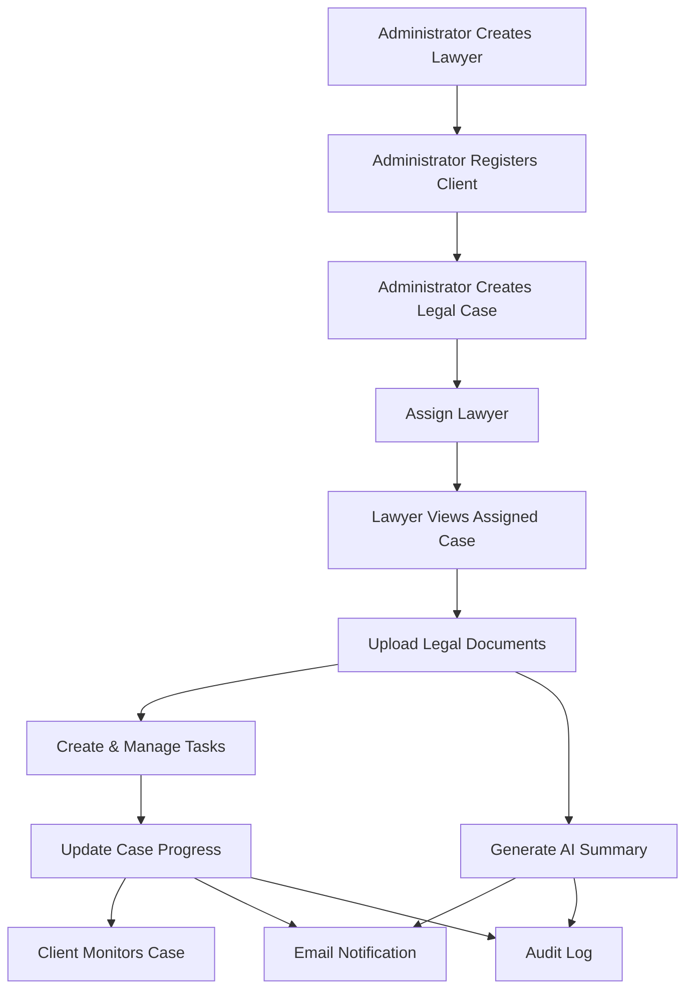

---

## 2.5 System Capabilities

LexFlow is composed of the following major business capabilities:

| Capability | Description |
|------------|-------------|
| Authentication | Secure login, JWT authentication, and role-based authorization |
| User Management | Manage lawyers and user accounts |
| Client Management | Register and maintain client information |
| Case Management | Create, assign, update, and track legal cases |
| Task Management | Create and assign case-related tasks |
| Document Management | Upload, download, and manage PDF documents |
| AI Integration | Generate AI summaries for uploaded legal documents |
| Dashboard | Display role-specific business insights |
| Search | Search clients, lawyers, and legal cases |
| Notifications | Send email notifications for business events |
| Audit Logging | Record important business activities |

---

## 2.6 System Boundary

LexFlow is responsible for managing legal operations within a single law firm.

The application interacts with the following external systems:

- AI Provider (for document summarization)
- SMTP Mail Server (for email notifications)
- Local File System (for document storage)

No third-party case management systems or external identity providers are integrated in Version 1.

---

## 2.7 Key Characteristics

The system is designed with the following characteristics:

- Single Law Firm Deployment
- Modular Monolith Architecture
- Layered Architecture
- RESTful API Communication
- Stateless Authentication using JWT
- Local File Storage
- Role-Based Access Control
- Production-Oriented Design
- Future Extensibility

---


# 3. Architectural Goals

## 3.1 Overview

The architecture of LexFlow is designed to satisfy both the functional requirements of a legal case management platform and the non-functional requirements expected from a production-ready enterprise application.

Rather than optimizing for unnecessary complexity, the architecture emphasizes simplicity, maintainability, security, and extensibility while remaining suitable for the expected scale of a single law firm.

The following architectural goals guide all design and implementation decisions throughout the project.

---

## 3.2 Maintainability

The primary objective of the architecture is to produce software that can be easily understood, modified, and extended by multiple developers over time.

To achieve this, the system follows:

- Modular Monolith Architecture
- Layered Architecture
- Separation of Concerns
- SOLID Principles
- Clean Code Practices

Business logic is isolated from infrastructure concerns, ensuring that future modifications have minimal impact on unrelated modules.

---

## 3.3 Modularity

The application is organized into independent business modules such as:

- Authentication
- User Management
- Client Management
- Case Management
- Task Management
- Document Management
- AI Integration
- Notifications
- Audit Logging

Each module owns its business responsibilities and exposes only the functionality required by other modules.

This minimizes coupling and improves long-term maintainability.

---

## 3.4 Scalability

Although Version 1 targets a single law firm, the architecture is designed to support future growth without requiring significant redesign.

The system should comfortably support:

- Hundreds of lawyers
- Thousands of clients
- Thousands of legal cases
- Large numbers of uploaded legal documents

The architecture also allows future migration toward distributed services if business requirements evolve.

---

## 3.5 Security

Legal applications manage highly sensitive information and therefore require security to be treated as a fundamental architectural concern rather than an afterthought.

The system is designed to provide:

- JWT-based authentication
- Role-Based Access Control (RBAC)
- Secure password hashing
- Input validation
- File validation
- Secure API communication
- Audit logging
- Least Privilege Principle

Every request entering the system must pass through appropriate authentication and authorization checks.

---

## 3.6 Extensibility

The architecture should allow future business capabilities to be introduced with minimal impact on existing modules.

Potential future enhancements include:

- Cloud file storage
- Multiple law firms (Multi-tenancy)
- AI-powered legal assistant
- Full-text document search
- Real-time notifications
- Calendar integrations
- External legal system integrations

The system is intentionally designed so that new modules can be introduced without major architectural changes.

---

## 3.7 Testability

The architecture promotes automated testing by maintaining clear separation between business logic and infrastructure.

This enables:

- Unit Testing
- Integration Testing
- API Testing

Business services should remain independent of HTTP concerns and persistence implementations wherever practical.

---

## 3.8 Performance

The application should provide responsive performance for typical day-to-day legal operations.

Performance considerations include:

- Efficient database queries
- Pagination for large datasets
- Lazy loading where appropriate
- Optimized document retrieval
- Minimized unnecessary database access

Performance optimizations will be introduced only when justified by measurable requirements.

---

## 3.9 Simplicity

A key architectural objective is to avoid unnecessary complexity.

The project intentionally avoids technologies that do not provide clear business value for Version 1.

Examples include:

- Microservices
- Kafka
- Kubernetes
- Event Sourcing
- CQRS

These technologies remain potential future enhancements but are outside the scope of the current system.

---

## 3.10 Production Readiness

Although developed as a portfolio project, LexFlow is designed using professional software engineering practices.

The architecture prioritizes:

- Readability
- Consistency
- Maintainability
- Secure coding practices
- Reusable components
- Clear module boundaries
- Production-quality API design

The objective is to produce software that resembles a real-world enterprise application rather than a demonstration project.

---

## 3.11 Architectural Goal Summary

| Goal | Objective |
|-------|-----------|
| Maintainability | Easy to understand, modify, and extend |
| Modularity | Independent business modules with clear responsibilities |
| Scalability | Support future growth without redesign |
| Security | Protect sensitive legal information |
| Extensibility | Enable future feature additions |
| Testability | Simplify automated testing |
| Performance | Efficient handling of business operations |
| Simplicity | Avoid unnecessary architectural complexity |
| Production Readiness | Follow professional engineering practices |

---

# 4. Architecture Style

## 4.1 Overview

LexFlow follows a **Modular Monolith Architecture** combined with a **Layered Architecture**. This architectural approach provides a balance between simplicity, maintainability, and scalability while remaining appropriate for the expected size and operational requirements of a single law firm.

The application is deployed as a single executable Spring Boot application while internally separating business capabilities into well-defined modules. Each module encapsulates its own business logic, reducing coupling and improving maintainability.

This approach allows the system to evolve organically without introducing the operational complexity associated with distributed systems.

---

## 4.2 Architectural Principles

The architecture is guided by the following principles:

- Business-driven design
- Separation of Concerns (SoC)
- Single Responsibility Principle (SRP)
- High Cohesion
- Low Coupling
- Dependency Inversion
- Explicit module boundaries
- Constructor-based Dependency Injection
- Composition over Inheritance
- Framework-independent business logic wherever practical

Every architectural decision should support long-term maintainability rather than short-term convenience.

---
---

## 4.3 Modular Monolith

LexFlow is implemented as a single deployable application containing multiple independent business modules.

Each module represents a specific business capability.

The major modules are:

- Authentication
- User Management
- Client Management
- Case Management
- Task Management
- Document Management
- AI Integration
- Dashboard
- Search
- Notification
- Audit Logging

Although these modules reside within the same application, they remain logically isolated through clearly defined interfaces and package boundaries.

This architecture provides many of the organizational benefits of microservices without introducing distributed system complexity.

### Benefits

- Single deployment
- Simple development workflow
- Easier debugging
- Lower infrastructure cost
- Simplified testing
- Faster feature development
- Clear business boundaries
- Easier onboarding for developers

---

## 4.4 Why Not Microservices?

Microservices were intentionally not selected for Version 1.

The expected workload consists of:

- One organization
- Hundreds of users
- Thousands of cases
- Moderate request volume

Introducing microservices at this stage would increase operational complexity without providing proportional business value.

Challenges introduced by microservices include:

- Service discovery
- Inter-service communication
- Distributed transactions
- Network latency
- Independent deployments
- Container orchestration
- Monitoring complexity

For the current business requirements, a Modular Monolith offers a significantly better cost-to-benefit ratio.

---

## 4.5 Layered Architecture

Within each business module, the application follows a layered architecture.

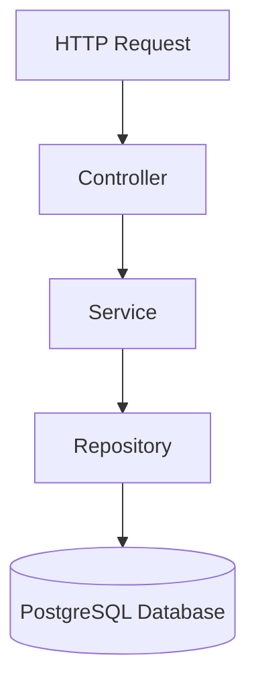

Each layer has a clearly defined responsibility.

### Presentation Layer

Responsible for:

- REST Controllers
- HTTP Request handling
- Validation
- Authentication entry points
- Response generation

The presentation layer must not contain business logic.

---

### Application Layer

Responsible for:

- Business workflows
- Use case orchestration
- Transaction management
- Business validations
- Calling repositories
- Integrating with infrastructure services

This layer contains the core business behavior of the application.

---

### Domain Layer

Responsible for:

- Business models
- Business rules
- Domain concepts
- Enumerations
- Value objects (where applicable)

The domain should remain independent of web and persistence frameworks whenever practical.

---

### Infrastructure Layer

Responsible for technical implementations including:

- Database persistence
- File storage
- Email sending
- AI integration
- Security configuration
- External service communication

Infrastructure supports the business but does not contain business rules.

---

## 4.6 Dependency Rules

To maintain clean architecture, dependencies must always flow inward.

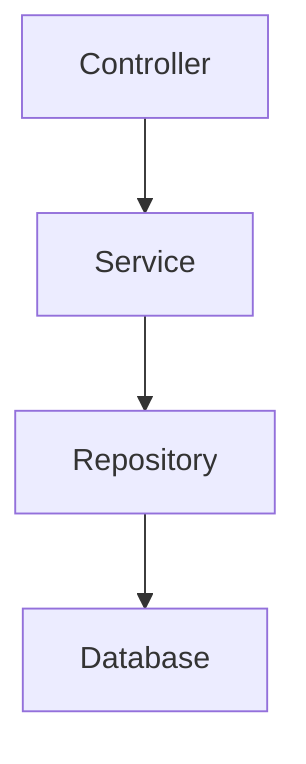

Allowed dependencies:

- Controller → Service
- Service → Repository
- Repository → Database
- Service → Infrastructure Services

Not allowed:

- Controller → Repository
- Controller → Database
- Repository → Service
- Module → Another Module's Repository
- Circular dependencies between modules

Cross-module communication must occur through public service interfaces rather than direct repository access.

---

## 4.7 Module Boundaries

Each business module owns its own business logic and data access responsibilities.

Example:

```text
Case Module

├── Controller
├── Service
├── Repository
├── Entity
├── DTO
└── Mapper
```

Other modules interact only with the Case Service and never directly access Case repositories or internal implementation details.

This approach minimizes coupling and allows internal implementation changes without affecting dependent modules.

---

## 4.8 Communication Style

LexFlow primarily uses synchronous communication.

Request flow:

Client

↓

Angular Frontend

↓

REST API

↓

Spring Boot Backend

↓

Database

Background operations such as AI summarization and email notifications are executed within the same application context.

No message brokers or distributed event streaming platforms are introduced in Version 1.

---

## 4.9 Architectural Constraints

The following constraints are intentionally enforced:

- Single deployable application
- Single PostgreSQL database
- Stateless REST APIs
- JWT-based authentication
- Local file storage
- Email-based notifications
- No distributed transactions
- No shared database across multiple applications
- No runtime module loading

These constraints simplify deployment while satisfying the business requirements of Version 1.

---

## 4.10 Architecture Summary

The selected architecture provides:

| Characteristic | Decision |
|---------------|----------|
| Architecture Style | Modular Monolith |
| Internal Structure | Layered Architecture |
| Communication | REST |
| Authentication | JWT |
| Database | PostgreSQL |
| File Storage | Local File System |
| Deployment | Single Application |
| Notifications | Email |
| AI Integration | External AI Provider |
| Scalability Strategy | Modular Expansion |

The architecture prioritizes maintainability, simplicity, and production readiness while providing a strong foundation for future evolution.


---


# 5. Technology Stack

## 5.1 Overview

LexFlow is built using a modern, production-oriented technology stack that prioritizes maintainability, developer productivity, security, and long-term extensibility.

The selected technologies align with the project's architectural goals while remaining appropriate for the expected scale of a single law firm.

The stack has been deliberately kept simple to avoid unnecessary operational complexity while still following enterprise software engineering practices.

---

## 5.2 Technology Stack Overview

| Layer | Technology | Purpose |
|--------|------------|---------|
| Frontend | Angular 19 | Single Page Application (SPA) |
| Backend | Spring Boot 3.x | REST API and Business Logic |
| Language | Java 17 | Backend Development |
| Build Tool | Maven | Dependency Management & Build Automation |
| Database | PostgreSQL | Relational Data Storage |
| Authentication | JWT | Stateless Authentication |
| Authorization | Role-Based Access Control (RBAC) | Secure Resource Access |
| ORM | Spring Data JPA (Hibernate) | Database Persistence |
| File Storage | Local File System | PDF Document Storage |
| AI Integration | External AI Provider | Document Summarization |
| Email Service | SMTP | Email Notifications |
| API Style | REST | Client-Server Communication |
| Version Control | Git & GitHub | Source Code Management |

---

# 5.3 Frontend

## Angular 19

Angular is used to build the web-based user interface of LexFlow.

### Responsibilities

- User Interface
- Routing
- Form Validation
- Authentication
- API Communication
- Dashboard Rendering
- State Management (Component Level)

### Why Angular?

- Mature enterprise framework
- Strong TypeScript support
- Component-based architecture
- Excellent tooling
- Built-in routing
- Reactive Forms
- Dependency Injection
- Long-term maintainability

Angular is well suited for large business applications with multiple modules and structured development teams.

---

# 5.4 Backend

## Spring Boot

Spring Boot serves as the backend framework responsible for implementing business logic and exposing REST APIs.

### Responsibilities

- Business Logic
- REST API
- Security
- Authentication
- Authorization
- Transaction Management
- Database Interaction
- File Handling
- AI Integration
- Email Sending

### Why Spring Boot?

- Enterprise-grade framework
- Mature ecosystem
- Excellent security support
- Dependency Injection
- Spring Data JPA
- Spring Security
- High maintainability
- Large community support

Spring Boot aligns well with production-grade enterprise application development.

---

# 5.5 Programming Language

## Java 17

Java 17 is the backend programming language used throughout the project.

### Why Java 17?

- Long-Term Support (LTS)
- Stable ecosystem
- Excellent performance
- Mature tooling
- Strong object-oriented capabilities
- Wide industry adoption
- Excellent compatibility with Spring Boot

Using an LTS version ensures long-term maintainability and production stability.

---

# 5.6 Build Tool

## Maven

Maven is used for dependency management and project build automation.

### Responsibilities

- Dependency Management
- Project Build
- Packaging
- Plugin Management

### Why Maven?

- Industry standard for Spring Boot
- Predictable project structure
- Easy dependency management
- Strong IDE support

---

# 5.7 Database

## PostgreSQL

PostgreSQL serves as the primary relational database.

### Responsibilities

- User Data
- Client Data
- Case Information
- Task Information
- Audit Logs
- Document Metadata

### Why PostgreSQL?

- ACID compliance
- Strong relational capabilities
- Excellent indexing
- Robust constraint support
- High reliability
- Open source
- Widely used in enterprise applications

A relational database is appropriate because LexFlow contains highly structured business data with numerous relationships.

---

# 5.8 Persistence Layer

## Spring Data JPA (Hibernate)

Spring Data JPA is used for object-relational mapping between Java entities and PostgreSQL.

### Responsibilities

- Entity Mapping
- CRUD Operations
- Query Execution
- Transaction Support

### Why Spring Data JPA?

- Reduces boilerplate code
- Repository abstraction
- Integration with Spring Boot
- Declarative transaction management
- Easy custom query support

---

# 5.9 Authentication

## JSON Web Token (JWT)

JWT is used to authenticate users across all protected APIs.

### Responsibilities

- Stateless Authentication
- User Identity
- Secure API Access

### Why JWT?

- Stateless architecture
- Scalable authentication
- Easy frontend integration
- Suitable for REST APIs
- No server-side session storage

---

# 5.10 File Storage

## Local File System

Uploaded PDF documents are stored on the server's local file system.

Only document metadata is persisted in the database.

### Why Local Storage?

- Simple deployment
- Easy implementation
- Suitable for MVP
- Low infrastructure cost

The storage layer is designed to allow migration to cloud storage in future versions.

---

# 5.11 AI Integration

## External AI Provider

An external AI service is used to generate summaries for uploaded legal documents.

### Responsibilities

- Document Summarization

### Workflow

PDF

↓

Extract Text

↓

Send Prompt

↓

Receive Summary

↓

Return Response

### Why External AI?

- High-quality language understanding
- No need to train custom models
- Faster development
- Easy future replacement

The backend communicates with the AI provider through a dedicated integration layer.

---

# 5.12 Email Service

## SMTP

SMTP is used for sending system-generated email notifications.

Supported notifications include:

- Case Assignment
- Task Assignment
- Password Change
- Account Creation
- Account Deactivation

### Why SMTP?

- Standard email protocol
- Simple integration
- Reliable
- Supported by Spring Boot

---

# 5.13 API Style

## REST

Communication between the frontend and backend is performed through RESTful APIs.

### Characteristics

- Stateless
- Resource-oriented
- JSON payloads
- Standard HTTP methods
- Standard HTTP status codes

REST provides a simple and widely adopted communication model suitable for business applications.

---

# 5.14 Version Control

## Git & GitHub

Git is used for source code management, while GitHub provides repository hosting and collaboration.

### Responsibilities

- Version Control
- Branch Management
- Code Reviews
- Collaboration
- Documentation

---

# 5.15 Technology Selection Summary

| Category | Selected Technology | Reason |
|----------|---------------------|--------|
| Frontend | Angular 19 | Enterprise SPA Framework |
| Backend | Spring Boot | Enterprise Application Framework |
| Language | Java 17 | Stable LTS Release |
| Build Tool | Maven | Standard Build Automation |
| Database | PostgreSQL | Reliable Relational Database |
| Persistence | Spring Data JPA | Simplified ORM |
| Authentication | JWT | Stateless Security |
| File Storage | Local File System | Simple MVP Storage |
| AI | External AI Provider | AI Document Summarization |
| Email | SMTP | Standard Email Delivery |
| API | REST | Simple Client-Server Communication |
| Version Control | Git & GitHub | Collaboration & Source Control |

---

# 5.16 Technologies Deferred for Future Versions

The following technologies were intentionally excluded from Version 1 because they do not provide sufficient business value for the current scope.

| Technology | Reason for Exclusion |
|------------|---------------------|
| Microservices | Unnecessary operational complexity |
| Apache Kafka | No asynchronous distributed workflows |
| Redis | No identified caching bottleneck |
| Elasticsearch | PostgreSQL search is sufficient |
| Kubernetes | Single application deployment |
| Docker Swarm | Not required for MVP |
| GraphQL | REST adequately satisfies client requirements |
| WebSockets | Email notifications are sufficient |

These technologies remain potential future enhancements if business requirements evolve.


---

# 6. High-Level Architecture Diagram

## 6.1 Overview

LexFlow follows a traditional client-server architecture where the frontend communicates with a backend REST API. The backend encapsulates all business logic and interacts with the database, file storage, AI provider, and email server.

The application is deployed as a single Spring Boot application following a Modular Monolith architecture.

---

## 6.2 High-Level System Architecture

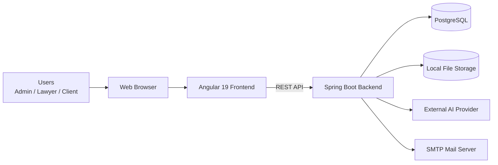

---

## 6.3 Component Responsibilities

### Angular Frontend

Responsibilities:

- User Authentication
- Dashboard Rendering
- Forms
- Client-side Validation
- API Communication
- Route Management

The frontend contains no business logic and communicates exclusively with the backend through REST APIs.

---

### Spring Boot Backend

Responsibilities:

- Authentication
- Authorization
- Business Logic
- Case Management
- Task Management
- Document Management
- AI Integration
- Email Notifications
- Audit Logging

The backend acts as the central component of the system.

---

### PostgreSQL

Stores structured business data including:

- Users
- Clients
- Cases
- Tasks
- Document Metadata
- Audit Logs

Uploaded PDF files are **not stored inside the database**.

---

### Local File Storage

Stores uploaded PDF documents.

Only the document metadata (file name, path, upload time, uploaded by, etc.) is stored in PostgreSQL.

---

### External AI Provider

Responsible for generating summaries of uploaded legal documents.

The backend sends extracted document text and receives a generated summary.

The AI provider never directly communicates with the frontend.

---

### SMTP Mail Server

Responsible for delivering email notifications.

Typical notifications include:

- Lawyer Assignment
- Task Assignment
- Password Changes
- Account Creation
- Account Deactivation

---

## 6.4 Internal Backend Architecture

Although deployed as a single application, the backend is internally divided into independent business modules.

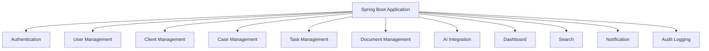

Each module owns its business logic while sharing the same application runtime and database.

---

## 6.5 External System Integration

LexFlow integrates with three external systems.

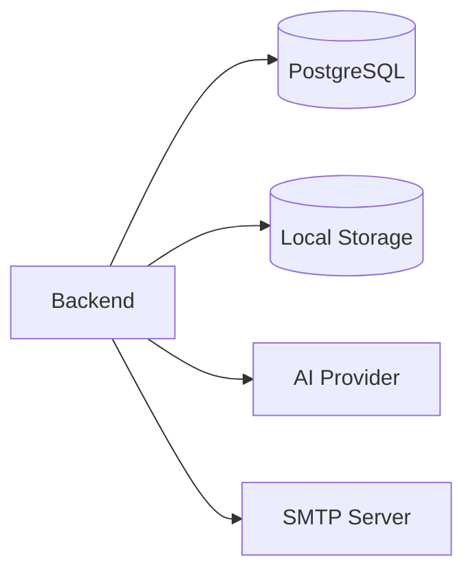

### PostgreSQL

Primary relational database.

---

### Local Storage

Stores uploaded PDF documents.

---

### AI Provider

Generates document summaries.

---

### SMTP

Sends system-generated email notifications.

---

## 6.6 Data Flow Overview

The overall flow of data through the system is illustrated below.

```mermaid
flowchart LR

User

-->

Angular

-->

REST API

-->

Business Services

-->

Repositories

-->

PostgreSQL

Business Services

-->

Local Storage

Business Services

-->

AI Provider

Business Services

-->

SMTP Server
```

This architecture ensures that all business operations pass through the service layer before interacting with persistence or external systems.

---

## 6.7 Architectural Characteristics

The high-level architecture provides the following characteristics:

| Characteristic | Description |
|---------------|-------------|
| Single Deployment | Entire application deployed as one Spring Boot application |
| Stateless APIs | Every request carries its authentication information |
| REST Communication | Frontend communicates using REST APIs |
| Modular Business Design | Independent business modules |
| Layered Architecture | Clear separation of responsibilities |
| External Integrations | AI and Email handled through dedicated services |
| Shared Database | Single PostgreSQL instance |
| Shared File Storage | Local filesystem for uploaded documents |

---

## 6.8 Benefits of the Architecture

The selected architecture provides several advantages:

- Simple deployment and maintenance
- Clear separation of business modules
- Easier debugging
- Low operational overhead
- Straightforward testing
- Strong maintainability
- Enterprise-ready organization
- Ability to evolve as business requirements grow

The architecture balances simplicity with extensibility, making it well suited for the current scope of LexFlow while leaving room for future enhancements.

---

# 7. Core Modules

## 7.1 Overview

LexFlow is organized into independent business modules, where each module is responsible for a specific business capability. This modular organization promotes high cohesion, low coupling, and simplifies maintenance as the application evolves.

Although all modules are deployed as part of a single Spring Boot application, each module encapsulates its own business logic and interacts with other modules only through well-defined service interfaces.

---

## 7.2 Module Overview

| Module | Primary Responsibility |
|---------|------------------------|
| Authentication | User authentication and authorization |
| User Management | Manage lawyers and user accounts |
| Client Management | Manage client information |
| Case Management | Manage legal cases |
| Task Management | Manage case-related tasks |
| Document Management | Manage legal documents |
| AI Integration | Generate document summaries |
| Dashboard | Provide role-based dashboards |
| Search | Search across business entities |
| Notification | Send email notifications |
| Audit Logging | Record important system activities |

---

## 7.3 Authentication Module

### Responsibility

Provides secure authentication and authorization for all users.

### Key Capabilities

- User Login
- JWT Authentication
- Refresh Token Management
- Password Change
- Role Validation
- Session Security

### Collaborates With

- User Management
- Security Configuration
- All Protected Modules

---

## 7.4 User Management Module

### Responsibility

Manages lawyer accounts and system users.

### Key Capabilities

- Create User
- Update User
- Disable User
- View User
- Search Users

### Collaborates With

- Authentication
- Case Management
- Notification
- Audit Logging

---

## 7.5 Client Management Module

### Responsibility

Maintains client information throughout the lifecycle of legal cases.

### Key Capabilities

- Register Client
- Update Client
- Soft Delete Client
- View Client
- Search Clients

### Collaborates With

- Case Management
- Search
- Audit Logging

---

## 7.6 Case Management Module

### Responsibility

Acts as the central business module responsible for managing legal cases.

### Key Capabilities

- Create Case
- Assign Lawyer
- Update Case Status
- Update Priority
- Close Case
- Track Progress

### Collaborates With

- User Management
- Client Management
- Task Management
- Document Management
- Notification
- Audit Logging

---

## 7.7 Task Management Module

### Responsibility

Manages tasks associated with legal cases.

Tasks may be assigned by a lawyer to themselves or to the client associated with the case.

### Key Capabilities

- Create Task
- Assign Task
- Update Task
- Complete Task
- View Tasks by Case

### Collaborates With

- Case Management
- User Management
- Notification
- Audit Logging

---

## 7.8 Document Management Module

### Responsibility

Manages legal documents associated with cases.

### Key Capabilities

- Upload PDF Documents
- Download Documents
- Soft Delete Documents
- View Documents
- Store Metadata

### Collaborates With

- Case Management
- AI Integration
- Audit Logging

---

## 7.9 AI Integration Module

### Responsibility

Generates AI-powered summaries for uploaded legal documents.

### Key Capabilities

- Extract Document Text
- Send Request to AI Provider
- Generate Summary
- Regenerate Summary

Summaries are generated on demand and are **not persisted** in the database.

### Collaborates With

- Document Management

---

## 7.10 Dashboard Module

### Responsibility

Provides role-specific business insights.

### Key Capabilities

Administrator Dashboard

- Total Lawyers
- Total Clients
- Total Cases
- Open Cases
- Closed Cases

Lawyer Dashboard

- Assigned Cases
- Pending Tasks
- Recent Documents

Client Dashboard

- Active Cases
- Shared Documents
- Assigned Tasks

### Collaborates With

- All Business Modules

---

## 7.11 Search Module

### Responsibility

Provides centralized search across business entities.

### Searchable Resources

- Clients
- Lawyers
- Cases

### Collaborates With

- User Management
- Client Management
- Case Management

---

## 7.12 Notification Module

### Responsibility

Sends email notifications for important business events.

### Notification Events

- Lawyer Assigned
- Task Assigned
- Case Status Updated
- Password Changed
- User Created
- User Disabled

### Collaborates With

- Authentication
- User Management
- Case Management
- Task Management

---

## 7.13 Audit Logging Module

### Responsibility

Maintains an audit trail of important business activities for accountability and traceability.

### Logged Activities

- User Login
- User Creation
- Client Creation
- Case Creation
- Lawyer Assignment
- Task Assignment
- Document Upload
- Document Deletion
- Password Change

### Collaborates With

All business modules.

---

## 7.14 Module Relationship Diagram

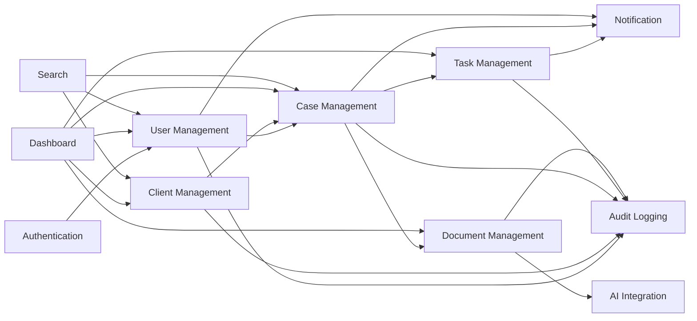

---

## 7.15 Module Design Principles

The following principles govern all modules:

- Every module owns a single business capability.
- Modules communicate through service interfaces.
- Modules do not directly access another module's repositories.
- Business rules remain inside the owning module.
- Each module follows the layered architecture defined in this document.
- Cross-cutting concerns such as security and audit logging are shared without violating module boundaries.

This modular organization enables the application to remain maintainable, testable, and extensible while avoiding the operational complexity of distributed systems.

---

# 8. Module Interaction

## 8.1 Overview

LexFlow is organized into independent business modules that collaborate to fulfill business workflows. While modules may depend on one another, each module remains responsible for its own business logic and data.

Module interactions are intentionally kept simple and synchronous. Communication occurs through service interfaces within the same application process, avoiding unnecessary complexity such as message brokers or distributed communication.

---

## 8.2 Interaction Principles

The following principles govern communication between modules:

- Modules communicate only through public service interfaces.
- Business logic remains within the owning module.
- Modules never access another module's repositories directly.
- Circular dependencies between modules are prohibited.
- Cross-cutting concerns are handled through shared infrastructure components.
- Communication is synchronous for Version 1.

---

## 8.3 Module Dependency Diagram

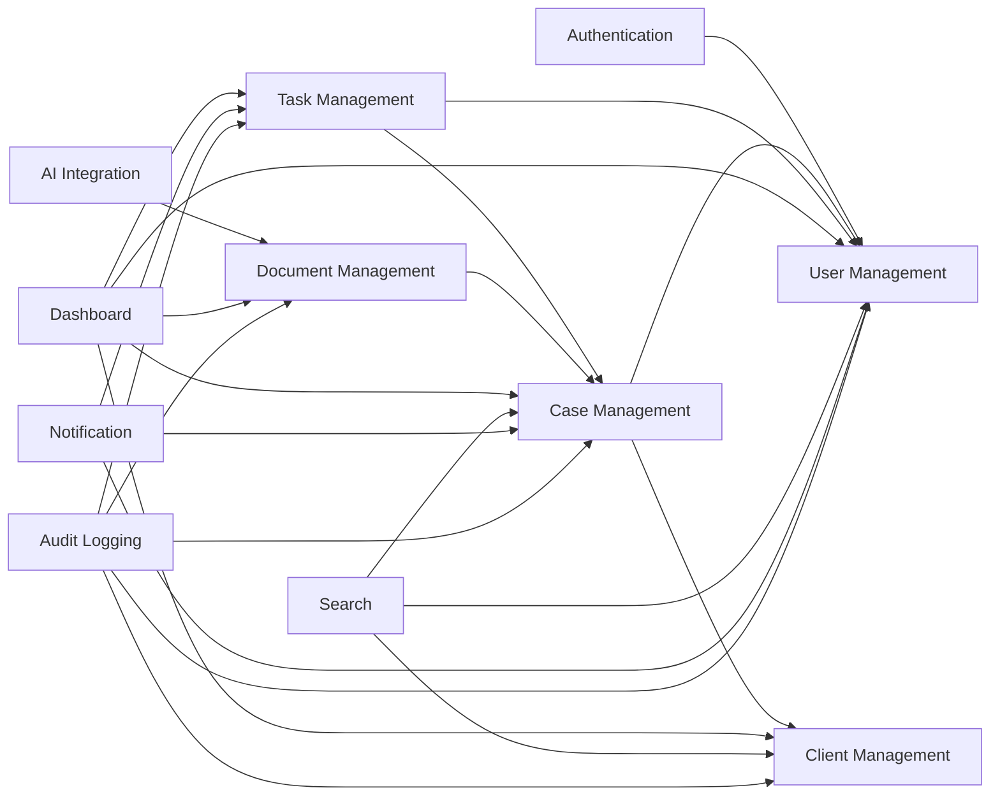

---

## 8.4 Business Workflow Interactions

The following table summarizes how modules collaborate during common business operations.

| Business Operation | Modules Involved |
|--------------------|------------------|
| User Login | Authentication → User Management |
| Create Client | Client Management |
| Create Case | Case Management → Client Management → User Management |
| Assign Lawyer | Case Management → User Management → Notification |
| Create Task | Task Management → Case Management → User Management |
| Upload Document | Document Management → Case Management |
| Generate AI Summary | AI Integration → Document Management |
| Send Email Notification | Notification |
| View Dashboard | Dashboard → Multiple Modules |
| Search Cases | Search → Case Management |

---

## 8.5 Cross-Cutting Components

Certain capabilities are shared across multiple modules without belonging to a single business domain.

### Authentication

Protects all secured endpoints.

Used by:

- User Management
- Client Management
- Case Management
- Task Management
- Document Management

---

### Notification

Sends email notifications when important business events occur.

Triggered by:

- User Management
- Case Management
- Task Management

---

### Audit Logging

Records significant system activities for traceability.

Used by:

- Authentication
- User Management
- Client Management
- Case Management
- Task Management
- Document Management

---

## 8.6 Dependency Rules

The following dependency rules are enforced throughout the application.

### Allowed

```text
Controller
      ↓
Service
      ↓
Repository
      ↓
Database
```

```text
Case Service
      ↓
User Service
```

```text
Task Service
      ↓
Case Service
```

---

### Not Allowed

```text
Controller
      ↓
Repository
```

```text
Client Module
      ↓
Case Repository
```

```text
Task Repository
      ↓
Case Repository
```

```text
Module A
      ↕
Module B
```

Circular dependencies are strictly prohibited.

---

## 8.7 Interaction Characteristics

The architecture intentionally adopts synchronous communication for all module interactions.

### Advantages

- Simpler implementation
- Easier debugging
- Immediate response handling
- Lower operational complexity
- Easier testing

Given the expected scale of Version 1, synchronous communication provides the best balance between simplicity and maintainability.

---

## 8.8 Future Evolution

As the application grows, module interactions can evolve without requiring major architectural changes.

Potential future enhancements include:

- Event-driven communication
- Message queues
- Kafka
- Domain Events
- Asynchronous processing
- Distributed services

These enhancements are intentionally deferred because they do not provide sufficient business value for the current scope of the application.

---

## 8.9 Summary

The interaction model emphasizes clear module boundaries, explicit dependencies, and synchronous collaboration. By restricting communication through service interfaces and preventing direct repository access across modules, the architecture remains maintainable, loosely coupled, and easier to extend as new business capabilities are introduced.

---

# 9. Request Lifecycle

## 9.1 Overview

Every user interaction within LexFlow follows a consistent request lifecycle. The frontend communicates with the backend through REST APIs, where each request is authenticated, authorized, processed by the appropriate business module, persisted when necessary, and returned as a structured response.

The application follows a layered architecture to ensure a clear separation of responsibilities and maintainability.

---

## 9.2 Standard Request Lifecycle

The following diagram illustrates the lifecycle of a typical request.

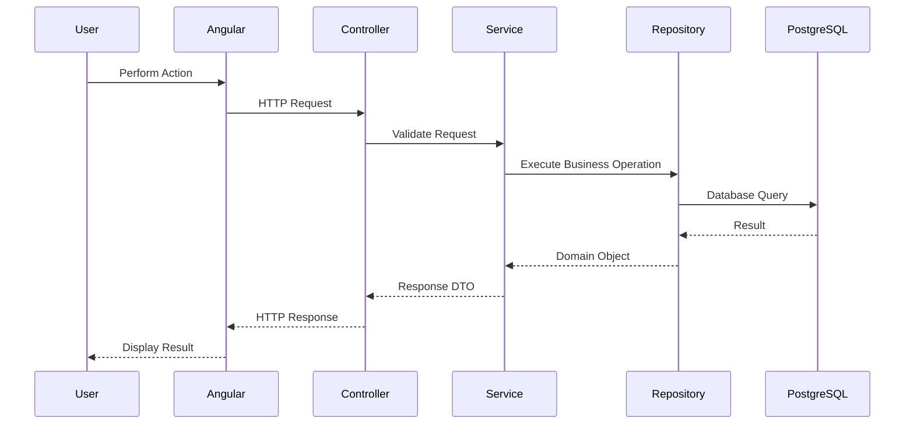

Every request follows this flow regardless of the business module.

---

## 9.3 Request Processing Stages

### Step 1 — User Interaction

The user performs an action through the Angular web application.

Examples include:

- Login
- Create Client
- Create Case
- Upload Document
- Generate AI Summary
- Complete Task

---

### Step 2 — HTTP Request

Angular sends a REST API request to the Spring Boot backend.

The request contains:

- HTTP Method
- Endpoint
- Request Body
- Authorization Header (JWT)
- Query Parameters (if applicable)

---

### Step 3 — Authentication & Authorization

Spring Security intercepts the request before it reaches the application.

The security layer performs:

- JWT Validation
- User Authentication
- Role Verification
- Access Control

Unauthorized requests are rejected immediately.

---

### Step 4 — Controller

The controller acts as the entry point for the request.

Responsibilities include:

- Receiving HTTP requests
- Request validation
- Invoking application services
- Returning HTTP responses

Controllers do not contain business logic.

---

### Step 5 — Service Layer

The service layer contains the application's business logic.

Responsibilities include:

- Business rule validation
- Workflow orchestration
- Calling repositories
- Invoking external services
- Managing transactions

This is where the majority of application behavior resides.

---

### Step 6 — Repository Layer

Repositories handle persistence.

Responsibilities include:

- Reading data
- Writing data
- Updating records
- Executing database queries

Repositories are responsible only for data access.

---

### Step 7 — Database

PostgreSQL persists all structured business data.

Examples include:

- Users
- Clients
- Cases
- Tasks
- Document Metadata
- Audit Logs

Business logic is never implemented inside the database.

---

### Step 8 — Response Generation

The service converts the business result into a response DTO.

The controller returns an appropriate HTTP response containing:

- Status Code
- Response Body
- Error Details (if applicable)

The frontend then updates the user interface.

---

## 9.4 Example Request Flow – Create Case

The following diagram illustrates the lifecycle of creating a legal case.

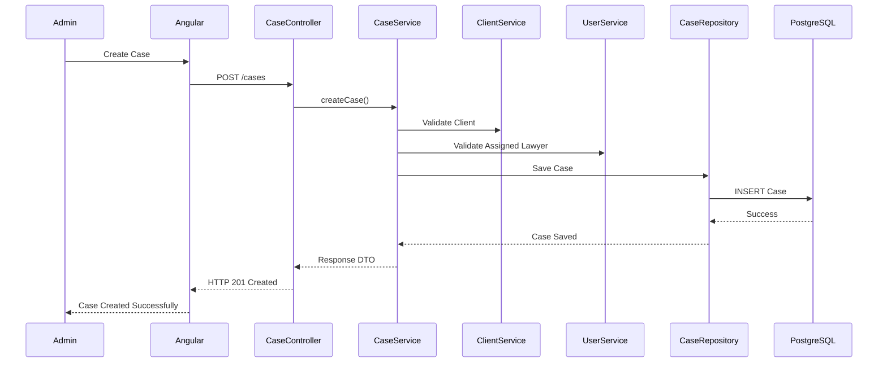

---

## 9.5 Request Lifecycle with External Services

Some requests require interaction with external systems.

Examples include:

- AI Summary Generation
- Email Notifications
- File Uploads

The service layer coordinates these integrations while keeping controllers independent of infrastructure concerns.

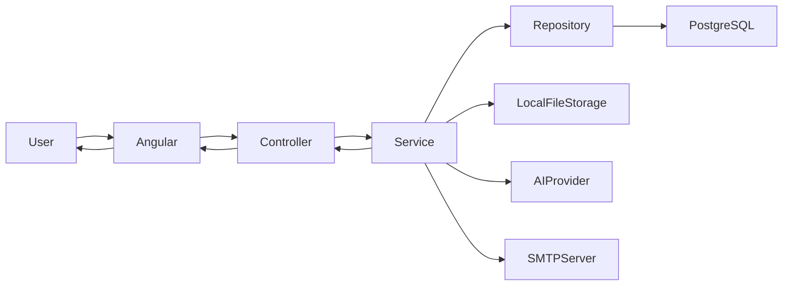

---

## 9.6 Error Handling Flow

If an exception occurs during request processing, a centralized exception handler generates a consistent API response.

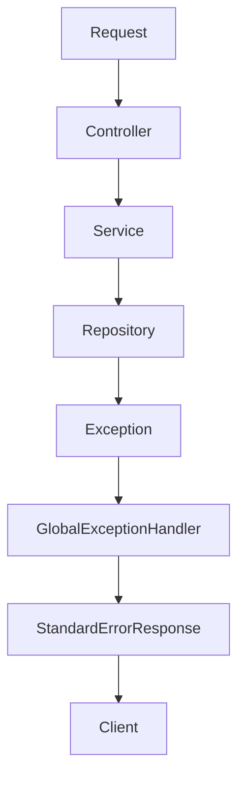

Centralized error handling ensures:

- Consistent API responses
- Improved debugging
- Cleaner controllers
- Better maintainability

---

## 9.7 Transaction Management

Business operations that modify multiple resources are executed within a single transactional boundary.

Typical transactional operations include:

- Creating a Case
- Updating Case Status
- Creating Tasks
- Uploading Document Metadata
- Soft Deleting Records

If any operation within the transaction fails, the transaction is rolled back to maintain data consistency.

---

## 9.8 Request Lifecycle Characteristics

The request lifecycle follows these architectural principles:

- Stateless REST communication
- Layered processing
- Service-oriented business logic
- Repository-based persistence
- Centralized exception handling
- Consistent response structure
- Secure request processing
- Transactional business operations

---

## 9.9 Summary

The request lifecycle establishes a predictable and consistent processing model across the entire application. Every request follows the same layered flow from the Angular frontend to the Spring Boot backend, ensuring maintainability, testability, and clear separation of responsibilities while keeping business logic independent of HTTP and persistence concerns.

---


# 10. Authentication & Authorization Flow

## 10.1 Overview

LexFlow secures all protected resources using **JWT (JSON Web Token)** based authentication combined with **Role-Based Access Control (RBAC)**.

The application follows a stateless authentication model where each request carries a valid access token. The backend validates the token before allowing access to protected resources.

Only authenticated users can access the application, and every request is authorized based on the user's assigned role.

---

## 10.2 Authentication Architecture

```mermaid
flowchart LR

User

-->

Angular

-->

Login API

-->

Authentication Module

Authentication Module --> PostgreSQL

Authentication Module --> JWT Generator

JWT Generator --> Angular

Angular --> User
```

---

## 10.3 Login Flow

The login process consists of the following steps:

1. User enters email and password.
2. Angular sends credentials to the backend.
3. Spring Security authenticates the user.
4. User credentials are verified against the database.
5. Password is validated using BCrypt.
6. A JWT Access Token and Refresh Token are generated.
7. Tokens are returned to the frontend.
8. Angular stores the tokens securely.
9. Future API requests include the Access Token.

---

## 10.4 Authentication Sequence Diagram

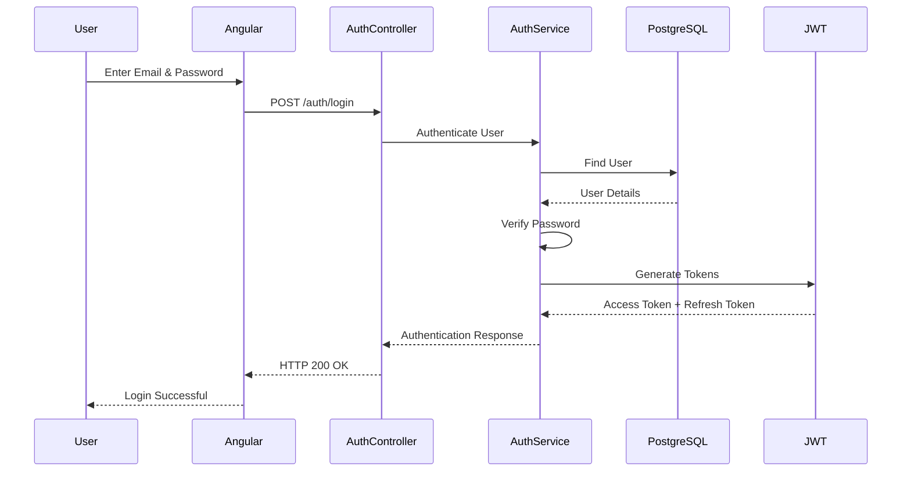

---

## 10.5 Authorization Flow

Once authenticated, every protected request follows the authorization flow shown below.

```mermaid
flowchart TD

Client Request

-->

JWT Filter

JWT Filter --> Validate Token

Validate Token --> Extract User

Extract User --> Check Role

Check Role --> Authorized

Authorized --> Controller

Check Role --> AccessDenied

AccessDenied --> HTTP403
```

---

## 10.6 Role-Based Access Control (RBAC)

LexFlow defines three system roles.

| Role | Responsibilities |
|------|------------------|
| Admin | Full system access |
| Lawyer | Manage assigned cases and tasks |
| Client | View own cases and assigned tasks |

Every protected endpoint specifies the roles that are permitted to access it.

Examples:

| Resource | Admin | Lawyer | Client |
|-----------|:----:|:------:|:------:|
| User Management | ✅ | ❌ | ❌ |
| Client Management | ✅ | ❌ | ❌ |
| Case Management | ✅ | ✅ | Read Only |
| Task Management | ❌ | ✅ | Assigned Tasks Only |
| Document Upload | ❌ | ✅ | ❌ |
| Document Download | ✅ | ✅ | Shared Documents |
| AI Summary | ❌ | ✅ | ❌ |

---

## 10.7 Token Lifecycle

LexFlow uses two JWT tokens.

### Access Token

Purpose:

- Authenticate API requests.

Characteristics:

- Short-lived.
- Included in every protected request.
- Validated by Spring Security.

---

### Refresh Token

Purpose:

- Obtain a new Access Token without requiring the user to log in again.

Characteristics:

- Longer expiration period.
- Rotated after successful refresh.
- Stored securely.

This approach improves security while providing a better user experience.

---

## 10.8 Password Security

User passwords are never stored in plain text.

Security measures include:

- BCrypt password hashing.
- Password verification using hash comparison.
- Password changes require authentication.
- Passwords are never returned in API responses.

---

## 10.9 Session Model

LexFlow follows a **stateless session model**.

Characteristics:

- No HTTP sessions.
- No server-side user session storage.
- Authentication state maintained through JWT.
- Horizontal scaling is simplified.

---

## 10.10 Security Considerations

The authentication architecture provides the following security measures:

- JWT Authentication
- Refresh Token Rotation
- Role-Based Access Control
- BCrypt Password Hashing
- Stateless Authentication
- Protected REST APIs
- Secure Password Storage
- Authentication before Authorization

---

## 10.11 Summary

The authentication and authorization architecture ensures that only authenticated users can access protected resources while enforcing role-based permissions across the application. By combining JWT authentication, refresh token rotation, BCrypt password hashing, and RBAC, LexFlow provides a secure and scalable security model suitable for a production-ready enterprise application.


---

# 11. Document Storage Architecture

## 11.1 Overview

LexFlow allows lawyers to upload legal documents related to specific cases. These documents are stored on the server's local file system, while their associated metadata is maintained in the PostgreSQL database.

Separating file storage from business data keeps the database lightweight, improves performance, and simplifies future migration to cloud-based storage solutions.

Version 1 supports **PDF documents only**.

---

## 11.2 Storage Architecture

```mermaid
flowchart LR

Lawyer

-->

Angular

-->

Document API

-->

Document Service

Document Service --> PostgreSQL

Document Service --> LocalFileSystem

PostgreSQL --> DocumentMetadata[(Document Metadata)]

LocalFileSystem --> PDFFile[(PDF Files)]
```

---

## 11.3 Storage Components

### Angular Frontend

Responsibilities:

- Select PDF document
- Validate file before upload
- Upload document
- Display uploaded documents
- Download documents

---

### Document Service

Responsibilities:

- Validate uploaded file
- Verify associated case
- Generate unique file name
- Store file on local filesystem
- Save metadata in database
- Handle document retrieval
- Perform soft deletion

---

### PostgreSQL

Stores document metadata only.

Typical metadata includes:

- Document ID
- Original File Name
- Stored File Name
- File Path
- File Size
- Upload Timestamp
- Uploaded By
- Related Case
- Active Status (Soft Delete)

The actual PDF content is **not** stored in the database.

---

### Local File System

Stores the physical PDF files.

Responsibilities:

- Persist uploaded documents
- Retrieve documents for download
- Maintain organized directory structure

---

## 11.4 Document Upload Flow

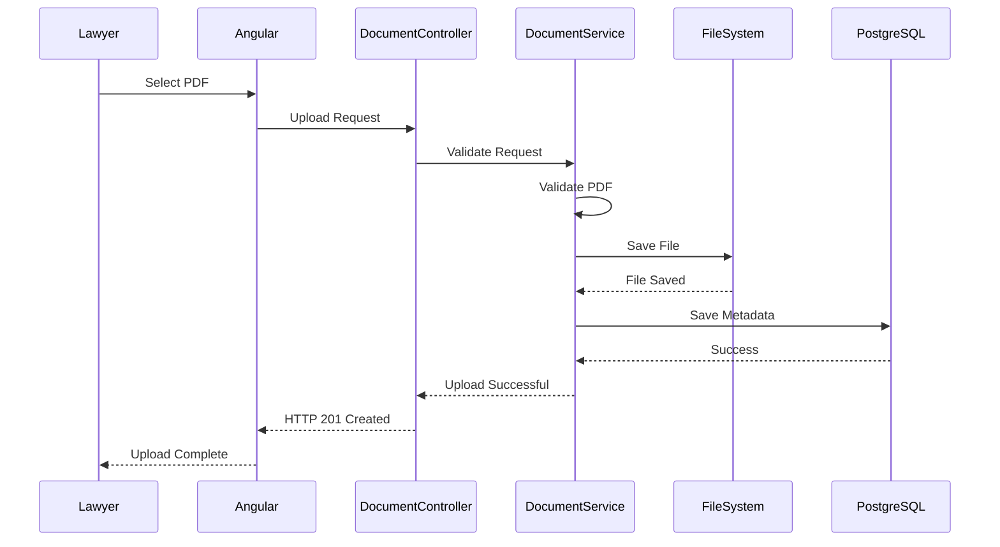

---

## 11.5 Document Download Flow

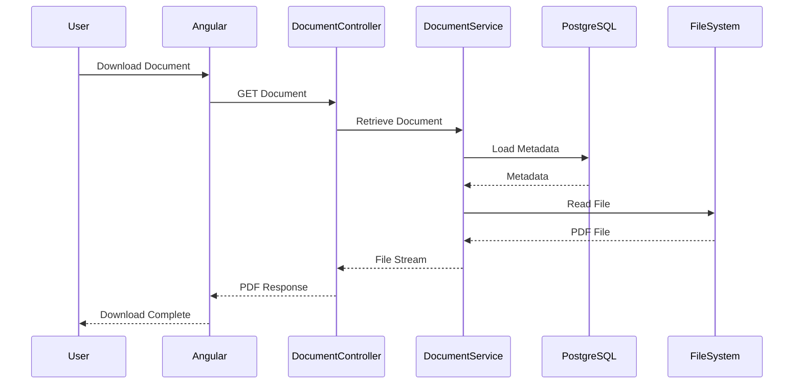

---

## 11.6 Soft Delete Strategy

LexFlow uses **soft deletion** for documents.

When a document is deleted:

- The metadata is marked as inactive.
- The document is hidden from normal users.
- The file remains on disk.
- Audit history is preserved.

This approach prevents accidental data loss and supports future recovery if required.

---

## 11.7 File Validation

Before storing a document, the system performs several validation checks.

Validation includes:

- File must be a PDF.
- File size must not exceed the configured limit.
- Associated case must exist.
- User must have permission to upload.
- File must not be corrupted.

Invalid uploads are rejected before storage.

---

## 11.8 Directory Structure

Uploaded documents are organized on the local filesystem using a structured directory layout.

Example:

```text
uploads/
└── cases/
    ├── CASE-0001/
    │   ├── document-1.pdf
    │   └── document-2.pdf
    ├── CASE-0002/
    │   └── document-1.pdf
    └── CASE-0003/
        └── document-1.pdf
```

Organizing files by case simplifies maintenance and retrieval.

---

## 11.9 Security Considerations

The document storage architecture incorporates the following security measures:

- File type validation
- File size validation
- Role-based upload authorization
- Secure file naming
- Metadata validation
- Soft deletion
- Access control for downloads

Direct access to uploaded files is not permitted. All file operations must pass through the backend.

---

## 11.10 Future Evolution

The storage layer has been designed to support future enhancements with minimal architectural changes.

Potential improvements include:

- Amazon S3
- Azure Blob Storage
- Google Cloud Storage
- File Versioning
- Document Encryption
- Virus Scanning
- CDN Integration

These enhancements can be introduced by replacing the storage implementation without affecting business modules.

---

## 11.11 Summary

The document storage architecture separates physical document storage from business metadata, resulting in a clean, maintainable, and scalable solution. Local file storage satisfies the requirements of Version 1 while preserving the flexibility to adopt cloud-based storage solutions in future releases.

---


# 12. AI Integration Architecture

## 12.1 Overview

LexFlow integrates with an external AI service to generate concise summaries of uploaded legal documents. This capability assists lawyers in quickly understanding lengthy legal documents without manually reading the entire content.

The AI integration is designed as an independent architectural component that communicates with an external AI provider through a dedicated integration layer.

For Version 1, summaries are generated **on demand** and are **not persisted**. Each request invokes the AI service and returns the generated summary directly to the user.

---

## 12.2 AI Architecture

```mermaid
flowchart LR

Lawyer

-->

Angular

-->

AI API

-->

AI Service

AI Service --> LocalFileStorage

AI Service --> TextExtraction

TextExtraction --> PromptBuilder

PromptBuilder --> ExternalAI

ExternalAI --> AI Service

AI Service --> Angular

Angular --> Lawyer
```

---

## 12.3 AI Processing Workflow

The AI summary generation process consists of the following steps:

1. Lawyer selects an uploaded PDF document.
2. Angular sends a summary generation request.
3. Backend verifies document access permissions.
4. PDF is retrieved from local storage.
5. Text is extracted from the document.
6. A prompt is constructed for the AI provider.
7. The prompt is sent to the external AI service.
8. AI generates a summary.
9. The summary is returned to the frontend.
10. The summary is displayed to the lawyer.

Since summaries are generated dynamically, no summary data is stored after the response is returned.

---

## 12.4 AI Request Flow

```mermaid
sequenceDiagram

participant Lawyer
participant Angular
participant AIController
participant AIService
participant FileSystem
participant AIProvider

Lawyer->>Angular: Generate Summary

Angular->>AIController: POST /documents/{id}/summary

AIController->>AIService: Generate Summary

AIService->>FileSystem: Load PDF

FileSystem-->>AIService: PDF File

AIService->>AIService: Extract Text

AIService->>AIProvider: Send Prompt

AIProvider-->>AIService: Summary

AIService-->>AIController: Summary Response

AIController-->>Angular: HTTP 200 OK

Angular-->>Lawyer: Display Summary
```

---

## 12.5 AI Service Responsibilities

The AI Integration module is responsible for:

- Retrieving uploaded documents
- Extracting text from PDF files
- Preparing prompts for the AI provider
- Invoking the external AI service
- Returning generated summaries
- Handling AI-related errors and timeouts

The module is **not responsible** for storing summaries or managing document metadata.

---

## 12.6 Text Extraction

Before invoking the AI provider, the backend extracts textual content from the uploaded PDF.

Responsibilities include:

- Reading PDF content
- Ignoring unsupported elements
- Preparing clean text for prompt generation

Only extracted text is transmitted to the AI provider.

---

## 12.7 AI Provider Integration

The AI provider is treated as an external dependency.

Responsibilities include:

- Processing prompts
- Generating summaries
- Returning structured responses

The integration layer isolates the application from vendor-specific implementation details, making it easier to replace the AI provider in the future.

---

## 12.8 Error Handling

Possible failures include:

- AI service unavailable
- Network timeout
- Invalid AI response
- PDF text extraction failure
- Empty document
- Unsupported document content

If an error occurs, the application returns a standardized error response while ensuring the uploaded document remains unaffected.

---

## 12.9 Security Considerations

The AI integration follows several security practices:

- Only authorized lawyers can generate summaries.
- Documents are accessed through the backend only.
- Direct access to the AI provider is not permitted from the frontend.
- AI API credentials remain on the server.
- Only extracted document text is transmitted to the external AI provider.

---

## 12.10 Future Enhancements

The AI module is designed to support future capabilities, including:

- Legal document question answering
- Clause extraction
- Contract risk analysis
- Named entity recognition
- AI-powered legal recommendations
- Citation extraction
- Conversation history
- Multiple AI provider support

These enhancements can be incorporated without affecting other business modules.

---

## 12.11 Summary

The AI Integration Architecture enables lawyers to generate on-demand summaries of legal documents using an external AI provider. By isolating AI functionality within a dedicated module and avoiding persistence of generated summaries, the architecture remains simple, secure, and easily extensible while supporting future AI-driven capabilities.

---

# 13. Email Notification Architecture

## 13.1 Overview

LexFlow sends email notifications to users when important business events occur. These notifications improve communication between the law firm and its users by informing them of significant actions such as case assignments, task assignments, and account-related events.

For Version 1, email delivery is performed synchronously using an SMTP server. Given the expected workload of a single law firm, this approach provides sufficient performance while keeping the architecture simple.

---

## 13.2 Email Notification Architecture

```mermaid
flowchart LR

BusinessModule[Business Module]

BusinessModule

-->

NotificationService

NotificationService

-->

SMTPServer[(SMTP Server)]

SMTPServer

-->

Recipient[Recipient Email]
```

The Notification Service acts as a centralized component responsible for sending all system-generated emails.

---

## 13.3 Notification Workflow

The notification process consists of the following steps:

1. A business operation completes successfully.
2. The responsible business module determines that an email notification is required.
3. The Notification Service prepares the email content.
4. The Notification Service sends the email through the configured SMTP server.
5. The SMTP server delivers the email to the recipient.

Email notifications are sent only after the associated business operation completes successfully.

---

## 13.4 Email Notification Flow

```mermaid
sequenceDiagram

participant User
participant BusinessModule
participant NotificationService
participant SMTPServer
participant Mailbox

User->>BusinessModule: Perform Business Action

BusinessModule->>NotificationService: Send Email

NotificationService->>SMTPServer: SMTP Request

SMTPServer-->>Mailbox: Deliver Email

NotificationService-->>BusinessModule: Delivery Result

BusinessModule-->>User: Operation Completed
```

---

## 13.5 Notification Events

The following business events generate email notifications.

| Event | Recipient |
|--------|-----------|
| Lawyer Assigned to Case | Assigned Lawyer |
| Task Assigned | Assigned User |
| Password Changed | Account Owner |
| User Account Created | Newly Created User |
| User Account Disabled | Disabled User |

Additional notification events can be introduced without changing the overall architecture.

---

## 13.6 Notification Service Responsibilities

The Notification Service is responsible for:

- Preparing email content
- Selecting the appropriate email template
- Sending emails through SMTP
- Handling delivery failures
- Logging email delivery attempts

The service is intentionally independent of business modules and contains no business rules.

---

## 13.7 Module Interaction

The following modules may trigger email notifications.

```mermaid
flowchart LR

UserManagement

-->

NotificationService

CaseManagement

-->

NotificationService

TaskManagement

-->

NotificationService

NotificationService

-->

SMTPServer
```

Business modules remain responsible for deciding **when** an email should be sent, while the Notification Service is responsible for **how** it is sent.

---

## 13.8 Error Handling

Email delivery failures do not invalidate completed business operations.

If email delivery fails:

- The business transaction remains committed.
- The failure is logged.
- An error is returned internally for monitoring purposes.
- The user is informed that the primary operation succeeded, even if the notification could not be delivered.

This approach prevents temporary email server issues from affecting core business functionality.

---

## 13.9 Security Considerations

The email architecture incorporates the following security measures:

- SMTP credentials are stored securely using application configuration.
- Email recipients are validated before sending.
- Sensitive information is not included in email content.
- Authentication tokens and passwords are never transmitted by email.
- Email communication uses secure SMTP connections when supported.

---

## 13.10 Future Enhancements

The notification architecture is designed to support future enhancements, including:

- HTML email templates
- Notification preferences
- Scheduled reminder emails
- Daily digest emails
- SMS notifications
- In-app notifications
- Asynchronous email processing
- Message queue integration

These enhancements can be introduced without affecting existing business modules.

---

## 13.11 Summary

The Email Notification Architecture centralizes all email delivery within a dedicated Notification Service. Business modules remain responsible for determining when notifications are required, while the Notification Service manages message composition and delivery. This separation of concerns improves maintainability, simplifies testing, and provides a clear path for future expansion.


---

# 14. Deployment Architecture

## 14.1 Overview

LexFlow is designed as a web-based client-server application deployed using a single-server architecture. The frontend, backend, database, and document storage work together to provide a centralized legal case management platform.

The deployment architecture prioritizes simplicity, maintainability, and ease of deployment while supporting the expected workload of a single law firm.

---

## 14.2 Deployment Components

The production environment consists of the following components.

| Component | Technology |
|-----------|------------|
| Frontend | Angular 19 |
| Backend | Spring Boot 3 (Java 17) |
| Database | PostgreSQL |
| Document Storage | Local File System |
| AI Provider | External AI Service |
| Email Service | SMTP Server |

---

## 14.3 Deployment Architecture Diagram

```mermaid
flowchart LR

Users

-->

Browser

-->

Angular

Angular

-->

SpringBoot

SpringBoot

-->

PostgreSQL

SpringBoot

-->

LocalStorage

SpringBoot

-->

AIProvider

SpringBoot

-->

SMTPServer
```

---

## 14.4 Component Responsibilities

### Angular Frontend

Responsible for:

- User Interface
- Form Validation
- API Communication
- Authentication State
- Route Navigation

The frontend communicates only with the backend using REST APIs.

---

### Spring Boot Backend

Responsible for:

- Business Logic
- Authentication
- Authorization
- Case Management
- Document Management
- AI Integration
- Email Notifications
- Database Access

The backend acts as the central component of the application.

---

### PostgreSQL

Responsible for storing structured application data.

Examples include:

- Users
- Clients
- Cases
- Tasks
- Document Metadata
- Audit Logs

---

### Local File Storage

Responsible for storing uploaded PDF documents.

Only metadata is stored in PostgreSQL.

---

### External AI Provider

Responsible for generating document summaries.

The backend communicates securely with the AI provider.

---

### SMTP Server

Responsible for delivering system-generated email notifications.

---

## 14.5 Deployment Environment

### Development Environment

Used by developers during implementation.

Components:

- Angular Development Server
- Spring Boot Application
- PostgreSQL
- Local File Storage
- SMTP Development Server

---

### Production Environment

Production deployment consists of:

- Angular Build
- Spring Boot Application
- PostgreSQL Database
- Local Document Storage
- SMTP Server
- External AI Provider

---

## 14.6 Deployment Flow

```mermaid
sequenceDiagram

participant User
participant Browser
participant Angular
participant SpringBoot
participant PostgreSQL

User->>Browser: Open Application

Browser->>Angular: Load Frontend

Angular->>SpringBoot: API Request

SpringBoot->>PostgreSQL: Query

PostgreSQL-->>SpringBoot: Result

SpringBoot-->>Angular: JSON Response

Angular-->>Browser: Update UI
```

---

## 14.7 Environment Configuration

Different environments maintain independent configurations.

Typical configuration includes:

- Database Connection
- JWT Secret
- SMTP Configuration
- AI API Key
- File Upload Location
- Server Port
- Logging Level

Sensitive configuration values should never be committed to source control.

---

## 14.8 Deployment Characteristics

The selected deployment architecture provides:

- Single deployment unit
- Simple operational model
- Low infrastructure cost
- Easy maintenance
- Straightforward monitoring
- Fast deployment
- Minimal operational overhead

These characteristics align with the requirements of Version 1.

---

## 14.9 Future Evolution

As the application grows, the deployment architecture can evolve to support:

- Docker containers
- Reverse proxy (Nginx)
- Cloud object storage
- Dedicated file server
- Multiple application instances
- Load balancing
- Distributed caching
- CI/CD pipelines
- Kubernetes deployment

These enhancements can be introduced incrementally without requiring significant changes to the application architecture.

---

## 14.10 Summary

LexFlow adopts a simple and practical deployment architecture suitable for a single law firm. By deploying the frontend, backend, database, and local document storage as a cohesive system, the application remains easy to deploy, operate, and maintain while providing a solid foundation for future scalability.

---


# 15. Scalability Considerations

## 15.1 Overview

Although LexFlow Version 1 is designed for a single law firm, the architecture has been developed with scalability in mind. The application emphasizes modularity, maintainability, and extensibility so that future growth can be accommodated without significant architectural changes.

Rather than optimizing prematurely for large-scale distributed systems, the current design focuses on building a solid architectural foundation that can evolve as business requirements expand.

---

## 15.2 Current Scale Assumptions

The current architecture is designed to support:

- A single law firm
- Hundreds of users
- Thousands of clients
- Thousands of legal cases
- Thousands of legal documents
- Moderate daily application usage

These assumptions align with the project's business objectives and allow the system to remain simple while delivering reliable performance.

---

## 15.3 Application Scalability

The backend is organized as a Modular Monolith with clearly defined business modules.

This architecture provides several scalability advantages:

- Independent business modules
- Low coupling between modules
- High cohesion within modules
- Easier maintenance
- Simplified testing
- Clear ownership of business logic

As the application grows, individual modules can be extracted into independent services if business requirements justify such a transition.

---

## 15.4 Database Scalability

PostgreSQL provides a robust foundation for managing structured legal data.

Scalability is supported through:

- Proper database normalization
- Foreign key relationships
- Indexing on frequently searched fields
- Pagination for large result sets
- Efficient query design

The database schema is designed to minimize redundancy while maintaining data integrity.

---

## 15.5 Document Storage Scalability

Uploaded documents are stored on the local file system, while only document metadata is maintained in the database.

This separation provides several advantages:

- Reduced database size
- Faster database backups
- Improved query performance
- Simpler file management

If storage requirements increase, the storage implementation can be replaced with cloud-based object storage without affecting business logic.

---

## 15.6 Security Scalability

The security architecture supports future growth by using stateless authentication.

Key characteristics include:

- JWT-based authentication
- Refresh token mechanism
- Role-Based Access Control (RBAC)
- Stateless REST APIs

Since authentication state is not maintained on the server, the backend can be scaled horizontally if required in future deployments.

---

## 15.7 Maintainability

Scalability is not limited to handling more users or data. It also includes the ability to evolve the codebase efficiently.

The application improves long-term maintainability through:

- Modular architecture
- Layered architecture
- SOLID principles
- Clear separation of concerns
- Reusable components
- Standardized coding conventions

These practices reduce technical debt and simplify future feature development.

---

## 15.8 Future Scaling Path

If business growth requires additional capacity, the architecture can evolve incrementally through:

- Deploying multiple backend instances
- Introducing a reverse proxy and load balancer
- Migrating document storage to cloud object storage
- Implementing distributed caching
- Introducing asynchronous processing for long-running tasks
- Splitting business modules into independent microservices where appropriate

These enhancements can be adopted without requiring a complete redesign of the application.

---

## 15.9 Summary

LexFlow is intentionally designed to satisfy the current needs of a single law firm while providing a clear path for future growth. By emphasizing modularity, clean architecture, stateless communication, and well-defined module boundaries, the system remains maintainable, extensible, and capable of scaling as business requirements evolve.

---


# 16. Conclusion

LexFlow has been designed as a secure, maintainable, and scalable Legal Case Management Platform that addresses the operational needs of a modern law firm. The architecture emphasizes simplicity without compromising software engineering best practices, making it suitable for both real-world deployment and long-term maintenance.

The system adopts a **Modular Monolith** architecture with clearly defined business modules and a **Layered Architecture** that separates presentation, application, domain, and infrastructure concerns. This approach promotes high cohesion, low coupling, and a clean separation of responsibilities, allowing the application to evolve while remaining easy to understand and maintain.

Security is incorporated as a core architectural concern through JWT-based authentication, Role-Based Access Control (RBAC), secure password hashing, protected REST APIs, input validation, and controlled access to uploaded documents. These measures ensure that sensitive legal information is protected throughout the system.

The application integrates essential business capabilities, including user management, client management, case management, task management, document management, AI-powered document summarization, email notifications, and role-based dashboards. Each module has a clearly defined responsibility and collaborates with other modules through well-defined service boundaries.

The chosen technology stack—Angular 19, Spring Boot 3, Java 17, PostgreSQL, local file storage, and an external AI provider—provides a reliable and enterprise-ready foundation while remaining appropriate for the expected scale of a single law firm.

Overall, the architecture balances current business requirements with future extensibility. By prioritizing clean code, modular design, maintainability, and security, LexFlow establishes a solid foundation that can support future growth while remaining practical for Version 1 of the application.