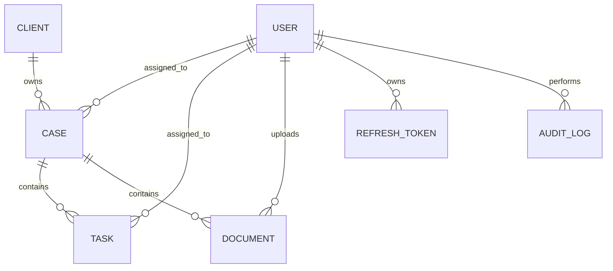

# 1. Introduction

## 1.1 Purpose

This Low-Level Design (LLD) document defines the implementation blueprint for **LexFlow**, an AI-Powered Legal Case Management Platform. It provides the detailed technical design required to translate the approved business requirements and high-level architecture into a production-ready software solution.

The document describes the application's internal structure, database schema, REST API specifications, module responsibilities, security design, and application workflows. It serves as the primary reference for developers during implementation and helps ensure consistency across the codebase.

---

## 1.2 Scope

This document covers the technical design for Version 1 (MVP) of LexFlow.

The following aspects are included:

- Repository and project structure
- Backend and frontend architecture
- Database schema and entity relationships
- REST API design
- Module-level responsibilities
- Application workflows
- Security design
- Exception handling
- Logging and audit strategy
- Design patterns and coding standards

The document focuses on implementation details and assumes that the business requirements and architectural decisions have already been established in the Software Requirements Specification (SRS) and High-Level Design (HLD).

---

## 1.3 Intended Audience

This document is intended for:

- Software Developers
- Software Architects
- Technical Reviewers
- Quality Assurance Engineers
- Future Project Maintainers

It provides sufficient technical detail to support implementation, testing, code reviews, and future maintenance activities.

---

## 1.4 Design Objectives

The implementation of LexFlow is guided by the following engineering objectives:

- Maintain a clean and modular codebase.
- Follow Layered Architecture with clearly defined module boundaries.
- Adhere to SOLID principles and clean coding practices.
- Build secure REST APIs using JWT-based authentication and Role-Based Access Control (RBAC).
- Design a normalized relational database that preserves data integrity.
- Develop reusable and testable business components.
- Ensure the application remains maintainable and extensible as business requirements evolve.

---

## 1.5 Document Organization

The remainder of this document is organized as follows:

- **Design Principles** – Defines the engineering principles and architectural guidelines followed during implementation.
- **Project Structure** – Describes the repository layout and package organization.
- **Database Design** – Defines the relational schema, entity relationships, and indexing strategy.
- **API Design** – Specifies REST API contracts for each business module.
- **Module Design** – Describes the responsibilities and interactions of each application module.
- **Application Workflows** – Illustrates key business processes using sequence diagrams.
- **Security Design** – Documents authentication, authorization, and API security mechanisms.
- **Exception Handling and Logging** – Defines the application's error handling and audit strategy.
- **Design Patterns and Coding Standards** – Summarizes implementation conventions adopted throughout the project.

---

# 2. Design Principles

## 2.1 Overview

The implementation of LexFlow follows a set of design principles that promote maintainability, readability, security, and long-term scalability. These principles ensure that the codebase remains consistent and easy to extend as new features are introduced.

The project emphasizes simplicity and clean design over unnecessary complexity, with architectural decisions driven by business requirements rather than technology trends.

---

## 2.2 Modular Monolith

LexFlow is implemented as a **Modular Monolith**, where all business modules are deployed as a single application while remaining logically independent.

Each module encapsulates its own business logic and interacts with other modules only through well-defined service interfaces.

Current business modules include:

- Authentication
- User Management
- Client Management
- Case Management
- Task Management
- Document Management
- AI Integration
- Email Notification
- Dashboard
- Search

This approach provides a simple deployment model while maintaining clear module boundaries.

---

## 2.3 Layered Architecture

The backend follows a layered architecture to separate responsibilities and reduce coupling.

```text
Presentation Layer
        │
Application Layer
        │
Domain Layer
        │
Infrastructure Layer
```

### Presentation Layer

Responsible for:

- REST Controllers
- Request Validation
- HTTP Response Generation

This layer contains no business logic.

---

### Application Layer

Responsible for:

- Business Services
- Transaction Management
- Business Rules
- Module Coordination

This layer contains the core business logic of the application.

---

### Domain Layer

Responsible for:

- Domain Models
- Business Entities
- Enumerations
- Domain-specific rules

The domain remains independent of framework-specific concerns whenever practical.

---

### Infrastructure Layer

Responsible for:

- Database Access
- File Storage
- Email Integration
- AI Provider Integration
- External System Communication

This layer implements technical concerns required by the application.

---

## 2.4 Separation of Concerns

Each layer has a clearly defined responsibility.

- Controllers handle HTTP requests and responses.
- Services implement business logic.
- Repositories manage data persistence.
- External integrations are isolated within the infrastructure layer.

Business logic must never be implemented inside controllers or repositories.

---

## 2.5 Dependency Rules

Dependencies flow in a single direction.

```text
Controller
      │
      ▼
Service
      │
      ▼
Repository
      │
      ▼
Database
```

Modules communicate through service interfaces rather than directly accessing each other's repositories.

This reduces coupling and improves maintainability.

---

## 2.6 SOLID Principles

The implementation follows SOLID principles where they provide practical value.

Key guidelines include:

- Each class should have a single responsibility.
- Components should be open for extension but closed for modification.
- Interfaces should be small and focused.
- High-level components should depend on abstractions rather than concrete implementations.

These principles improve testability, readability, and long-term maintainability.

---

## 2.7 REST API Design Principles

All APIs follow RESTful design conventions.

Key principles include:

- Resource-oriented endpoints
- Appropriate HTTP methods
- Consistent response structures
- Standard HTTP status codes
- DTO-based request and response models
- Input validation
- Pagination for collection resources

Database entities are never exposed directly through the API.

---

## 2.8 Database Design Principles

The database design follows relational modeling best practices.

Key principles include:

- Normalized schema
- Meaningful primary and foreign keys
- Referential integrity
- Soft deletion where appropriate
- Indexed search fields
- Audit timestamps for business entities

Each table exists only if it fulfills a clear business requirement.

---

## 2.9 Security by Design

Security is incorporated throughout the implementation.

Core security practices include:

- JWT-based authentication
- Refresh token rotation
- Role-Based Access Control (RBAC)
- Password hashing using BCrypt
- Input validation
- Secure file upload validation
- Principle of Least Privilege

Security is treated as a fundamental architectural concern rather than an afterthought.

---

## 2.10 Maintainability Guidelines

To support long-term maintenance, the implementation follows these practices:

- Small, focused classes
- Constructor-based dependency injection
- Clear naming conventions
- Reusable components
- Minimal code duplication
- Consistent project structure
- Comprehensive exception handling

The codebase should be understandable, testable, and easy for new developers to navigate.

---

## 2.11 Summary

The design principles defined in this document establish a consistent foundation for implementing LexFlow. By adhering to modular architecture, layered design, clean coding practices, and secure development principles, the application remains maintainable, scalable, and aligned with enterprise software engineering standards.

---

# 3. Project Structure

## 3.1 Overview

LexFlow is organized as a monorepository (monorepo) that contains the backend application, frontend application, and project documentation within a single source code repository.

This structure simplifies version control, ensures consistency across the project, and allows both applications to evolve together while remaining logically independent.

---

## 3.2 Repository Structure

```text
lexflow/
│
├── backend/              # Spring Boot application
├── frontend/             # Angular application
├── docs/                 # Project documentation
│   ├── requirements.md
│   ├── hld.md
│   └── lld.md
│
├── .github/
│   └── CODEOWNERS
│
├── .gitignore
├── LICENSE
└── README.md
```

---

## 3.3 Repository Components

### Backend

Contains the Spring Boot application responsible for:

- Business logic
- REST APIs
- Authentication and authorization
- Database access
- AI integration
- Email notifications
- Document management

The backend serves as the central processing component of the system.

---

### Frontend

Contains the Angular application responsible for:

- User interface
- Client-side routing
- Form validation
- Dashboard views
- API communication
- Authentication state management

The frontend communicates exclusively with the backend through REST APIs.

---

### Documentation

The `docs` directory contains the project's technical documentation.

Current documents include:

| Document | Purpose |
|----------|---------|
| requirements.md | Software Requirements Specification (SRS) |
| hld.md | High-Level Design |
| lld.md | Low-Level Design |

These documents are maintained alongside the source code to ensure that architectural decisions remain synchronized with implementation.

---

### GitHub Configuration

The `.github` directory contains repository-level configuration.

Current configuration includes:

- CODEOWNERS for defining code ownership and review responsibilities.

Additional GitHub configurations such as CI/CD workflows or issue templates may be introduced as the project evolves.

---

## 3.4 Project Organization Principles

The repository follows the following organizational principles:

- Source code is separated by application.
- Documentation is version-controlled with the source code.
- Backend and frontend remain independently buildable.
- Shared architectural decisions are documented rather than duplicated.
- Repository root contains only project-level configuration files.

These principles promote maintainability and simplify onboarding for new developers.

---

## 3.5 Summary

The project structure provides a clean separation between backend, frontend, and documentation while keeping all project artifacts within a single repository. This organization supports efficient collaboration, simplifies project management, and establishes a clear foundation for the detailed package structures described in the following sections.

---

# 4. Backend Architecture & Package Structure

## 4.1 Overview

The LexFlow backend is implemented using **Spring Boot 3** and follows a **Modular Monolith** architecture with a **Layered Architecture**. The application is organized into business modules, each encapsulating its own business logic while sharing common infrastructure and configuration.

This structure promotes maintainability, testability, and clear separation of responsibilities.

---

## 4.2 Package Structure

```text
com.lexflow
│
├── config/                 # Application configuration
├── security/               # Authentication & authorization
├── common/                 # Shared components
├── exception/              # Global exception handling
├── audit/                  # Audit logging
│
├── auth/                   # Authentication module
├── user/                   # User management module
├── client/                 # Client management module
├── casemanagement/         # Case management module
├── task/                   # Task management module
├── document/               # Document management module
├── ai/                     # AI integration module
├── notification/           # Email notification module
├── dashboard/              # Dashboard module
├── search/                 # Search module
│
└── LexFlowApplication.java
```

---

## 4.3 Module Structure

Each business module follows the same internal organization.

```text
module/
│
├── controller/
├── service/
│   └── impl/
├── repository/
├── entity/
├── dto/
│   ├── request/
│   └── response/
├── mapper/
├── validator/
├── specification/
└── enums/
```

Maintaining a consistent structure across all modules improves readability and reduces onboarding time for new developers.

---

## 4.4 Shared Packages

### config

Contains application-wide configuration.

Examples include:

- Security configuration
- OpenAPI configuration
- CORS configuration
- Application beans

---

### security

Responsible for authentication and authorization.

Responsibilities include:

- JWT processing
- Authentication filters
- User details service
- Security configuration
- Password encoding
- Role-based authorization

---

### common

Contains reusable components shared across multiple modules.

Examples include:

- API response models
- Constants
- Utility classes
- Base entities
- Pagination models

Business logic should not be placed in this package.

---

### exception

Contains the global exception handling mechanism.

Responsibilities include:

- Custom exceptions
- Global exception handler
- Standard error responses

This ensures consistent error handling across the application.

---

### audit

Responsible for recording significant business events.

Examples include:

- User login
- User creation
- Case creation
- Document upload
- Task completion

Audit logging supports traceability and operational monitoring.

---

## 4.5 Business Modules

Each business module owns its domain logic and persistence.

| Module | Responsibility |
|---------|----------------|
| Authentication | Login, logout, refresh tokens, password management |
| User | Manage lawyers and administrators |
| Client | Manage client information |
| Case Management | Manage legal cases and lawyer assignments |
| Task | Manage case-related tasks |
| Document | Upload, download, and manage PDF documents |
| AI | Generate AI-powered document summaries |
| Notification | Send email notifications |
| Dashboard | Aggregate dashboard statistics |
| Search | Global search across supported entities |

Modules interact through the service layer rather than directly accessing each other's repositories.

---

## 4.6 Dependency Rules

The backend follows strict dependency rules.

```text
Controller
      │
      ▼
Service
      │
      ▼
Repository
      │
      ▼
Database
```

Business modules communicate only through service interfaces.

Direct repository access across modules is prohibited.

This prevents tight coupling and preserves module boundaries.

---

## 4.7 Design Conventions

The backend implementation follows these conventions:

- Controllers contain only HTTP-related logic.
- Services implement business rules.
- Repositories manage persistence only.
- DTOs define API contracts.
- Entities represent database tables.
- Mappers convert between entities and DTOs.
- Validators enforce business validation rules.
- Specifications implement dynamic search queries.

Each component has a single, well-defined responsibility.

---

## 4.8 Transaction Management

Business transactions are managed within the service layer.

The service layer is responsible for:

- Beginning transactions
- Coordinating repository operations
- Maintaining data consistency
- Rolling back failed transactions

Controllers and repositories do not manage transactions directly.

---

## 4.9 Summary

The backend architecture organizes the application into independent business modules supported by shared infrastructure. A consistent package structure, clear dependency rules, and layered architecture ensure that the codebase remains maintainable, testable, and scalable as the application evolves.

---

# 5. Frontend Project Structure

## 5.1 Overview

The LexFlow frontend is developed using **Angular 19** with standalone components and SCSS for styling. It follows a feature-based architecture that organizes the application into independent modules aligned with the business domains defined in the backend.

The frontend is responsible for user interaction, client-side validation, routing, state management, and communication with the backend REST APIs.

---

## 5.2 Project Structure

```text
frontend/
│
├── src/
│   ├── app/
│   │   ├── core/
│   │   ├── shared/
│   │   ├── features/
│   │   │   ├── auth/
│   │   │   ├── users/
│   │   │   ├── clients/
│   │   │   ├── cases/
│   │   │   ├── tasks/
│   │   │   ├── documents/
│   │   │   ├── dashboard/
│   │   │   └── search/
│   │   │
│   │   ├── layout/
│   │   ├── app.routes.ts
│   │   └── app.config.ts
│   │
│   ├── assets/
│   ├── environments/
│   └── styles.scss
│
├── angular.json
├── package.json
└── tsconfig.json
```

---

## 5.3 Core Module

The `core` package contains application-wide services and components that are instantiated only once.

Responsibilities include:

- Authentication service
- Route guards
- HTTP interceptors
- API configuration
- Global error handling
- Authentication state management

Components within this package are shared across the entire application.

---

## 5.4 Shared Module

The `shared` package contains reusable UI components and utilities.

Examples include:

- Reusable form components
- Confirmation dialogs
- Loading indicators
- Pagination component
- Common directives
- Pipes
- Shared models

Shared components should remain generic and independent of any specific business module.

---

## 5.5 Feature Modules

Each business feature is implemented within its own directory.

| Feature | Responsibility |
|----------|----------------|
| Auth | Login, logout, password management |
| Users | User management |
| Clients | Client management |
| Cases | Legal case management |
| Tasks | Task management |
| Documents | Document upload and download |
| Dashboard | Role-based dashboards |
| Search | Global search |

Each feature contains its own pages, components, services, and models.

---

## 5.6 Layout

The `layout` package defines the overall application structure.

Typical components include:

- Application shell
- Header
- Sidebar
- Navigation menu
- Footer

The layout adapts based on the authenticated user's role and permissions.

---

## 5.7 Routing Strategy

The application uses Angular Router with feature-based routing.

Routing responsibilities include:

- Public routes (Login)
- Protected routes
- Role-based route protection
- Lazy loading of feature modules where appropriate

Unauthorized users are redirected to the login page.

---

## 5.8 API Communication

The frontend communicates exclusively with the backend using REST APIs.

API communication follows these principles:

- Centralized HTTP services
- JWT automatically attached using an HTTP interceptor
- Consistent error handling
- Typed request and response models
- Environment-based API configuration

No business logic is implemented within UI components.

---

## 5.9 State Management

For Version 1, Angular's built-in reactive capabilities are sufficient.

Application state is managed using:

- Signals
- RxJS
- Services

External state management libraries such as NgRx are intentionally omitted to reduce complexity.

---

## 5.10 Summary

The frontend architecture adopts a feature-based organization that mirrors the backend business modules. Shared functionality is centralized within the `core` and `shared` packages, while business features remain isolated, promoting maintainability, scalability, and a consistent development experience.

---

# 6. Database Design

## 6.1 Overview

The LexFlow application uses **PostgreSQL** as its primary relational database management system. The database is designed to support the operational needs of a single law firm while maintaining data integrity, consistency, and efficient query performance.

The schema follows the principles of relational database design and normalization to minimize redundancy and enforce clear relationships between business entities.

Only structured business data and document metadata are stored in the database. Uploaded PDF documents remain on the local file system, while AI-generated summaries are generated on demand and are not persisted.

---

## 6.2 Database Design Principles

The database design follows the following principles:

- Third Normal Form (3NF) where practical
- Meaningful primary and foreign key relationships
- Soft deletion for recoverable business entities
- Audit fields for traceability
- Indexed search columns for frequently queried data
- UUID-based primary keys
- Referential integrity enforced through foreign key constraints

Every table exists to support a clearly defined business requirement.

---

## 6.3 Database Entities

The initial database schema consists of the following business entities.

| Entity | Purpose |
|----------|---------|
| User | Stores administrator and lawyer accounts |
| Client | Stores client information |
| Case | Stores legal case information |
| Task | Stores tasks associated with legal cases |
| Document | Stores metadata for uploaded PDF documents |
| Refresh Token | Stores active refresh tokens for authenticated users |
| Audit Log | Stores important system activities |

These entities collectively support the complete business workflow defined in the Software Requirements Specification.

---

## 6.4 Entity Relationship Diagram

> The complete Entity Relationship Diagram (ERD) is presented below.



---

## 6.5 Relationship Summary

The database relationships are summarized below.

| Parent Entity | Child Entity | Relationship |
|---------------|--------------|--------------|
| Client | Case | One-to-Many |
| User (Lawyer) | Case | One-to-Many |
| Case | Task | One-to-Many |
| Case | Document | One-to-Many |
| User | Task | One-to-Many |
| User | Document | One-to-Many |
| User | Refresh Token | One-to-Many |
| User | Audit Log | One-to-Many |

All relationships are enforced using foreign key constraints.

---

## 6.6 Audit Fields

Business entities maintain common audit information.

Standard audit fields include:

- Created At
- Updated At
- Created By
- Updated By

Entities supporting soft deletion additionally include:

- Deleted At
- Deleted By
- Active Status

These fields improve traceability and support operational auditing.

---

## 6.7 Soft Delete Strategy

The following entities support soft deletion.

- User
- Client
- Document

Soft deletion preserves historical data while preventing accidental loss of business information.

Entities such as Refresh Tokens and Audit Logs are managed according to their operational lifecycle and are not soft deleted.

---

## 6.8 Indexing Strategy

Indexes are created for columns that are frequently used in search operations and foreign key relationships.

Typical indexed columns include:

- Email Address
- Case Number
- Client Name
- Case Title
- Task Status
- Foreign Keys

Appropriate indexing improves query performance while avoiding unnecessary storage overhead.

---

## 6.9 Naming Conventions

The database follows consistent naming conventions.

- Table names use snake_case.
- Column names use snake_case.
- Primary keys use the suffix `_id`.
- Foreign keys reference the corresponding primary key.
- Constraint names are descriptive and consistent.

These conventions improve readability and simplify database maintenance.

---

## 6.10 Summary

The database design provides a normalized and maintainable relational model that accurately represents the LexFlow business domain. Clear entity relationships, audit support, indexing, and soft deletion strategies establish a strong foundation for the application while supporting future growth.

## 6.11 Database Schema

### 6.11.1 User

#### Purpose

The **User** table stores all authenticated users of the LexFlow system. It contains administrator and lawyer accounts responsible for managing legal cases, clients, documents, and tasks.

Clients are maintained in the **Client** table and do not exist as application users in Version 1.

---

#### Table Definition

| Column       | Data Type    | Constraints           | Description                             |
| ------------ | ------------ | --------------------- | --------------------------------------- |
| user_id      | UUID         | Primary Key           | Unique identifier of the user           |
| full_name    | VARCHAR(150) | NOT NULL              | Full name of the user                   |
| email        | VARCHAR(255) | NOT NULL, UNIQUE      | Login email address                     |
| password     | VARCHAR(255) | NOT NULL              | BCrypt hashed password                  |
| phone_number | VARCHAR(20)  | NOT NULL              | Contact number                          |
| address      | TEXT         | NULL                  | Residential address                     |
| designation  | VARCHAR(100) | NULL                  | Professional designation                |
| role         | VARCHAR(20)  | NOT NULL              | ADMIN or LAWYER                         |
| is_active    | BOOLEAN      | NOT NULL DEFAULT TRUE | Indicates whether the account is active |
| created_at   | TIMESTAMP    | NOT NULL              | Record creation timestamp               |
| updated_at   | TIMESTAMP    | NOT NULL              | Last modification timestamp             |
| created_by   | UUID         | NULL                  | User who created the record             |
| updated_by   | UUID         | NULL                  | User who last updated the record        |

---

#### Relationships

| Related Table | Relationship | Description                                      |
| ------------- | ------------ | ------------------------------------------------ |
| Case          | One-to-Many  | A lawyer can be assigned to multiple legal cases |
| Task          | One-to-Many  | A lawyer can own multiple tasks                  |
| Document      | One-to-Many  | A lawyer can upload multiple documents           |
| Refresh Token | One-to-Many  | A user may have multiple active refresh tokens   |
| Audit Log     | One-to-Many  | A user generates multiple audit log entries      |

---

#### Indexes

| Index Name      | Columns   | Purpose               |
| --------------- | --------- | --------------------- |
| idx_user_email  | email     | User authentication   |
| idx_user_role   | role      | Role-based filtering  |
| idx_user_active | is_active | Active user filtering |

---

#### Business Rules

* Every user must have a unique email address.
* Passwords are stored only as BCrypt hashes.
* Only **ADMIN** and **LAWYER** roles are supported in Version 1.
* Disabled users cannot authenticate.
* Every case must be assigned to an active lawyer.
* Users are never physically deleted from the database.
* Administrative actions are recorded in the Audit Log.

---

#### Notes

* UUID is used as the primary key to avoid predictable identifiers and simplify future scalability.
* The `role` column is restricted to predefined application roles using an enumeration.
* Passwords are never stored in plain text and are hashed using BCrypt before persistence.
* User accounts are deactivated using the `is_active` flag instead of being physically deleted, ensuring historical references remain intact.
* Audit fields provide complete traceability for record creation and modification.
* The `User` table serves as the parent entity for authentication, case assignments, task ownership, document uploads, refresh token management, and audit logging.

---

### 6.11.2 Refresh Token

#### Purpose

The **Refresh Token** table stores refresh tokens issued to authenticated users. It enables secure session management by allowing expired access tokens to be renewed without requiring users to authenticate again.

Refresh tokens are rotated after every successful refresh request to reduce the risk of token replay attacks.

---

#### Table Definition

| Column           | Data Type    | Constraints            | Description                                  |
| ---------------- | ------------ | ---------------------- | -------------------------------------------- |
| refresh_token_id | UUID         | Primary Key            | Unique identifier of the refresh token       |
| user_id          | UUID         | NOT NULL, Foreign Key  | References the authenticated user            |
| token            | VARCHAR(512) | NOT NULL, UNIQUE       | Refresh token value                          |
| expires_at       | TIMESTAMP    | NOT NULL               | Expiration date and time                     |
| revoked          | BOOLEAN      | NOT NULL DEFAULT FALSE | Indicates whether the token has been revoked |
| created_at       | TIMESTAMP    | NOT NULL               | Token creation timestamp                     |

---

#### Relationships

| Related Table | Relationship | Description                                    |
| ------------- | ------------ | ---------------------------------------------- |
| User          | Many-to-One  | Each refresh token belongs to exactly one user |

---

#### Indexes

| Index Name         | Columns    | Purpose                                   |
| ------------------ | ---------- | ----------------------------------------- |
| idx_refresh_token  | token      | Fast token lookup during refresh requests |
| idx_refresh_user   | user_id    | Retrieve all active sessions for a user   |
| idx_refresh_expiry | expires_at | Efficient cleanup of expired tokens       |

---

#### Business Rules

* Every refresh token belongs to a single authenticated user.
* A new refresh token is generated after every successful login.
* Refresh token rotation is mandatory; a new token replaces the previous one during token refresh.
* Revoked or expired refresh tokens cannot be reused.
* Logging out revokes the associated refresh token.
* Multiple active refresh tokens are permitted to support concurrent sessions across different devices or browsers.
* Expired refresh tokens are periodically removed by a scheduled cleanup process.

---

#### Notes

* Access tokens (JWTs) are stateless and are **not stored** in the database.
* Only refresh tokens are persisted to support secure session management.
* Refresh tokens should never be exposed through APIs except when initially issued during authentication.
* The combination of short-lived JWTs and refresh token rotation improves application security while maintaining a seamless user experience.


# 6.11.3 Client

## Purpose

The **Client** table stores information about individuals or organizations who are represented by the law firm. Each client can be associated with multiple legal cases.

Clients are not system users in Version 1 and do not have authentication access.

---

## Table Definition

| Column        | Data Type     | Constraints            | Description                        |
|--------------|--------------|------------------------|------------------------------------|
| client_id     | UUID         | Primary Key            | Unique identifier of the client    |
| full_name     | VARCHAR(150) | NOT NULL               | Name of the client                 |
| email         | VARCHAR(255) | NULL                   | Email address                      |
| phone_number  | VARCHAR(20)  | NULL                   | Contact number                     |
| address       | TEXT         | NULL                   | Physical address                   |
| client_type   | VARCHAR(20)  | NOT NULL               | INDIVIDUAL or ORGANIZATION        |
| is_active     | BOOLEAN      | DEFAULT TRUE           | Active status                      |
| created_at    | TIMESTAMP    | NOT NULL               | Record creation time               |
| updated_at    | TIMESTAMP    | NOT NULL               | Last update time                   |
| created_by    | UUID         | NULL                   | User who created record           |
| updated_by    | UUID         | NULL                   | User who updated record           |

---

## Relationships

| Related Table | Relationship | Description |
|---------------|-------------|-------------|
| Case          | One-to-Many | A client can have multiple cases |

---

## Business Rules

- A client must always have a name.
- Email is optional but must be unique if provided.
- Clients cannot log into the system.
- Clients are soft-deleted using `is_active`.
- Every case must belong to one client.

---

# 6.11.4 Case

## Purpose

The **Case** table represents legal matters handled by the firm. It is the central entity connecting clients, lawyers, tasks, and documents.

---

## Table Definition

| Column        | Data Type     | Constraints            | Description                      |
|--------------|--------------|------------------------|----------------------------------|
| case_id       | UUID         | Primary Key            | Unique case identifier           |
| case_number   | VARCHAR(50)  | UNIQUE, NOT NULL       | Human-readable case number       |
| title         | VARCHAR(255) | NOT NULL               | Case title                       |
| description   | TEXT         | NULL                   | Case details                     |
| status        | VARCHAR(30)  | NOT NULL               | OPEN, IN_PROGRESS, CLOSED        |
| priority      | VARCHAR(20)  | NOT NULL               | LOW, MEDIUM, HIGH                |
| client_id     | UUID         | Foreign Key            | Associated client                |
| assigned_to   | UUID         | Foreign Key (User)     | Assigned lawyer                  |
| filing_date   | DATE         | NULL                   | Case filing date                |
| is_active     | BOOLEAN      | DEFAULT TRUE           | Active status                   |
| created_at    | TIMESTAMP    | NOT NULL               | Created time                    |
| updated_at    | TIMESTAMP    | NOT NULL               | Updated time                   |

---

## Relationships

| Related Table | Relationship | Description |
|--------------|-------------|-------------|
| Client       | Many-to-One | Case belongs to one client |
| User         | Many-to-One | Case assigned to one lawyer |
| Task         | One-to-Many | Case contains multiple tasks |
| Document     | One-to-Many | Case contains multiple documents |

---

## Business Rules

- Each case must belong to exactly one client.
- Each case must be assigned to one active lawyer.
- Case number must be unique.
- Closed cases cannot be modified except by ADMIN.
- Deleting a client does not delete associated cases.

---

# 6.11.5 Task

## Purpose

The **Task** table stores actionable work items related to legal cases. Tasks help lawyers track work progress and deadlines.

---

## Table Definition

| Column      | Data Type     | Constraints            | Description                          |
|------------|--------------|------------------------|--------------------------------------|
| task_id     | UUID         | Primary Key            | Unique task identifier               |
| title       | VARCHAR(255) | NOT NULL               | Task title                          |
| description | TEXT         | NULL                   | Task details                        |
| status      | VARCHAR(30)  | NOT NULL               | TODO, IN_PROGRESS, DONE             |
| priority    | VARCHAR(20)  | NOT NULL               | LOW, MEDIUM, HIGH                   |
| due_date    | TIMESTAMP    | NULL                   | Task deadline                       |
| case_id     | UUID         | Foreign Key            | Related case                        |
| assigned_to | UUID         | Foreign Key (User)     | Assigned lawyer                     |
| created_at  | TIMESTAMP    | NOT NULL               | Created time                        |
| updated_at  | TIMESTAMP    | NOT NULL               | Updated time                        |
| is_active   | BOOLEAN      | DEFAULT TRUE           | Active status                       |

---

## Relationships

| Related Table | Relationship | Description |
|--------------|-------------|-------------|
| Case         | Many-to-One | Task belongs to a case |
| User         | Many-to-One | Task assigned to a lawyer |

---

## Business Rules

- Every task must belong to a case.
- A task must be assigned to an active user.
- Completed tasks cannot be modified except by ADMIN.
- Tasks inherit context from their parent case.

---

## Notes

- Tasks improve workflow tracking for legal case execution.
- Due dates are optional but recommended for enforcement of deadlines.

---

# 6.11.6 Document

## Purpose

The **Document** table stores metadata for legal documents uploaded into the system. Actual file content (PDFs, images, etc.) is stored in the file system or object storage, while the database maintains references and business context.

Documents are always associated with a specific case and optionally linked to a user who uploaded them.

---

## Table Definition

| Column         | Data Type     | Constraints            | Description                          |
|---------------|--------------|------------------------|--------------------------------------|
| document_id    | UUID         | Primary Key            | Unique document identifier           |
| file_name      | VARCHAR(255) | NOT NULL               | Original file name                   |
| file_type      | VARCHAR(50)  | NOT NULL               | MIME type (e.g., application/pdf)    |
| file_size      | BIGINT       | NOT NULL               | File size in bytes                   |
| file_path      | TEXT         | NOT NULL               | Storage location path                |
| case_id        | UUID         | Foreign Key            | Associated legal case                |
| uploaded_by    | UUID         | Foreign Key (User)     | User who uploaded document           |
| description    | TEXT         | NULL                   | Optional document description        |
| is_active      | BOOLEAN      | DEFAULT TRUE           | Active status                        |
| created_at     | TIMESTAMP    | NOT NULL               | Upload timestamp                     |
| updated_at     | TIMESTAMP    | NOT NULL               | Last update timestamp                |

---

## Relationships

| Related Table | Relationship | Description |
|---------------|-------------|-------------|
| Case          | Many-to-One | Document belongs to a case |
| User          | Many-to-One | Document uploaded by a user |

---

## Business Rules

- Every document must belong to a case.
- Only authenticated users can upload documents.
- File content is never stored in the database.
- Only metadata is persisted in this table.
- Deleted documents are soft deleted using `is_active`.
- File type validation is enforced at upload time.

---

## Notes

- File storage can be local filesystem (MVP) or cloud storage (future upgrade).
- This design ensures database remains lightweight and scalable.
- Document access is always controlled through backend APIs with RBAC enforcement.

---

# 6.11.7 Audit Log

## Purpose

The **Audit Log** table stores a chronological record of important system activities. It provides traceability, accountability, and compliance support for all critical actions performed in the system.

Audit logs are immutable and cannot be modified or deleted by any user.

---

## Table Definition

| Column        | Data Type     | Constraints            | Description                          |
|--------------|--------------|------------------------|--------------------------------------|
| audit_id      | UUID         | Primary Key            | Unique audit record identifier       |
| user_id       | UUID         | Foreign Key            | User who performed the action        |
| action        | VARCHAR(100) | NOT NULL               | Action type (CREATE, UPDATE, DELETE) |
| entity_type   | VARCHAR(100) | NOT NULL               | Entity affected (CASE, TASK, etc.)   |
| entity_id     | UUID         | NOT NULL               | ID of affected entity                |
| description   | TEXT         | NULL                   | Human-readable description           |
| ip_address    | VARCHAR(45)  | NULL                   | Source IP address                    |
| user_agent    | TEXT         | NULL                   | Client information                   |
| created_at    | TIMESTAMP    | NOT NULL               | Timestamp of action                 |

---

## Relationships

| Related Table | Relationship | Description |
|---------------|-------------|-------------|
| User          | Many-to-One | Audit log entry belongs to a user |

---

## Business Rules

- Every critical action must generate an audit log entry.
- Audit logs are immutable (no updates or deletes allowed).
- System-generated actions may have null user_id.
- Logs must include at minimum: action, entity type, entity ID.
- Audit logging must not block main business operations.

---

## Logged Events

Typical events captured:

- User login/logout
- Case creation/update/closure
- Task assignment and completion
- Document upload/delete
- Client creation/update
- Security events (failed login attempts)

---

## Notes

- Audit logging is implemented asynchronously to avoid performance overhead.
- Logs are critical for legal compliance and internal monitoring.
- Future enhancement may include exporting logs for compliance reporting.

---

# 7. REST API Design

## 7.1 Overview

This section defines the REST API contracts for core LexFlow modules. All APIs follow RESTful principles with consistent response structures, JWT-based authentication, and role-based access control (RBAC).

### API Standards

- Base URL: `/api/v1`
- Authentication: JWT Bearer Token
- Response Format: Standardized JSON wrapper
- Error Handling: Centralized error response model
- Pagination: page & size supported
- Security: Role-based access control

---

# 7.2 Authentication APIs

## Login

POST /api/v1/auth/login

Request:
{
  "email": "user@lexflow.com",
  "password": "password123"
}

Response:
{
  "status": "SUCCESS",
  "message": "Login successful",
  "data": {
    "accessToken": "jwt-token",
    "refreshToken": "refresh-token",
    "user": {
      "userId": "uuid",
      "fullName": "John Doe",
      "role": "LAWYER"
    }
  }
}

---

## Refresh Token

POST /api/v1/auth/refresh

Request:
{
  "refreshToken": "refresh-token"
}

Response:
{
  "status": "SUCCESS",
  "data": {
    "accessToken": "new-jwt-token",
    "refreshToken": "new-refresh-token"
  }
}

---

## Logout

POST /api/v1/auth/logout

Headers:
Authorization: Bearer <token>

Response:
{
  "status": "SUCCESS",
  "message": "Logged out successfully"
}

---

# 7.3 Case APIs

## Create Case

POST /api/v1/cases

Roles: ADMIN, LAWYER

Request:
{
  "caseNumber": "CASE-2026-001",
  "title": "Property Dispute",
  "description": "Land ownership dispute case",
  "priority": "HIGH",
  "clientId": "uuid",
  "assignedTo": "lawyer-uuid",
  "filingDate": "2026-06-29"
}

Response:
{
  "status": "SUCCESS",
  "data": {
    "caseId": "uuid",
    "caseNumber": "CASE-2026-001",
    "status": "OPEN"
  }
}

---

## Get Case by ID

GET /api/v1/cases/{caseId}

---

## Get All Cases (Paginated)

GET /api/v1/cases?page=0&size=10&status=OPEN

---

## Update Case

PUT /api/v1/cases/{caseId}

---

## Close Case

PATCH /api/v1/cases/{caseId}/close

---

## Delete Case (Soft Delete)

DELETE /api/v1/cases/{caseId}

---

# 7.4 Task APIs

## Create Task

POST /api/v1/tasks

Request:
{
  "title": "Prepare legal notice",
  "description": "Draft notice for client",
  "priority": "HIGH",
  "dueDate": "2026-07-05T10:00:00",
  "caseId": "uuid",
  "assignedTo": "user-uuid"
}

---

## Get Tasks by Case

GET /api/v1/tasks/case/{caseId}

---

## Update Task Status

PATCH /api/v1/tasks/{taskId}/status

Request:
{
  "status": "IN_PROGRESS"
}

---

## Assign Task

PATCH /api/v1/tasks/{taskId}/assign

---

## Delete Task (Soft Delete)

DELETE /api/v1/tasks/{taskId}

---

# 7.5 Document APIs

## Upload Document

POST /api/v1/documents/upload

Content-Type: multipart/form-data

Fields:
- file
- caseId
- description

---

## Get Documents by Case

GET /api/v1/documents/case/{caseId}

---

## Download Document

GET /api/v1/documents/{documentId}/download

---

## Delete Document (Soft Delete)

DELETE /api/v1/documents/{documentId}

---

# 7.6 Common Response Format

{
  "status": "SUCCESS | ERROR",
  "message": "Message",
  "data": {},
  "errors": []
}

---

# 7.7 Error Response Format

{
  "status": "ERROR",
  "message": "Validation failed",
  "errors": [
    {
      "field": "email",
      "message": "Email is required"
    }
  ]
}

---

# 7.8 Security Rules

- JWT required for all APIs except login
- Role-based access enforced
- 401 = Unauthorized
- 403 = Forbidden
- Refresh tokens are rotated

---

# 7.9 Summary

This API design ensures consistency, security, and scalability across all LexFlow modules.

---

# 8. Module Design

## 8.1 Overview

This section defines the internal design of each core backend module in LexFlow. Each module follows a consistent structure and is responsible for a specific business domain.

All modules follow:
- Layered Architecture (Controller → Service → Repository)
- DTO-based communication
- No direct cross-repository access
- Communication via service layer only

---

# 8.2 Authentication Module

## Responsibility

Handles user authentication, token management, and session lifecycle.

---

## Components

### Controller
- AuthController

### Services
- AuthService
- JwtService
- RefreshTokenService

---

## Key Responsibilities

- User login validation
- JWT token generation
- Refresh token rotation
- Logout handling
- Password verification

---

## Workflow

1. User submits login request
2. AuthService validates credentials
3. JWT access token generated
4. Refresh token stored in DB
5. Response returned to client

---

## Business Rules

- Passwords are BCrypt hashed
- Refresh token is single-use (rotated)
- Disabled users cannot login
- Access token is short-lived

---

# 8.3 User Module

## Responsibility

Manages system users (ADMIN, LAWYER).

---

## Components

### Controller
- UserController

### Services
- UserService

### Repository
- UserRepository

---

## Key Responsibilities

- Create/update users
- Activate/deactivate users
- Role management
- Fetch user profiles

---

## Business Rules

- Email must be unique
- Only ADMIN can create users
- Users are soft deleted
- Role cannot be changed after creation (V1 rule)

---

# 8.4 Client Module

## Responsibility

Manages clients who are represented in legal cases.

---

## Components

### Controller
- ClientController

### Services
- ClientService

### Repository
- ClientRepository

---

## Key Responsibilities

- Create and manage clients
- Fetch client-case relationships
- Soft delete clients

---

## Business Rules

- Clients are not system users
- Client email is optional
- Each client can have multiple cases

---

# 8.5 Case Management Module

## Responsibility

Core business module managing legal cases.

---

## Components

### Controller
- CaseController

### Services
- CaseService

### Repository
- CaseRepository

---

## Key Responsibilities

- Create cases
- Assign lawyers
- Track case status
- Link tasks and documents
- Close cases

---

## Workflow

1. Case created with client + assigned lawyer
2. Tasks and documents attached
3. Status updated during lifecycle
4. Case closed by ADMIN or assigned lawyer

---

## Business Rules

- Case must belong to one client
- Case must have one assigned lawyer
- Closed cases are read-only
- Case number must be unique

---

# 8.6 Task Module

## Responsibility

Manages tasks associated with legal cases.

---

## Components

### Controller
- TaskController

### Services
- TaskService

### Repository
- TaskRepository

---

## Key Responsibilities

- Create tasks
- Assign tasks to users
- Track task status
- Manage deadlines

---

## Workflow

1. Task created under a case
2. Assigned to a lawyer
3. Status updated (TODO → IN_PROGRESS → DONE)
4. Completion tracked in audit logs

---

## Business Rules

- Task must belong to a case
- Task must be assigned to a valid user
- Completed tasks are locked (except ADMIN)

---

# 8.7 Document Module

## Responsibility

Handles document upload, storage metadata, and retrieval.

---

## Components

### Controller
- DocumentController

### Services
- DocumentService
- FileStorageService

---

## Key Responsibilities

- Upload documents
- Store metadata in DB
- Retrieve documents by case
- Handle file download

---

## Workflow

1. File uploaded via API
2. File stored in filesystem
3. Metadata stored in DB
4. File retrieved via secure endpoint

---

## Business Rules

- Only PDF/DOC allowed (V1)
- File size validation required
- Each document belongs to a case
- Upload action is audited

---

# 8.8 AI Module (Future Ready)

## Responsibility

Provides AI-powered features like case summarization.

---

## Components

- AiController
- AiService
- OpenAiClient (or external provider integration)

---

## Key Responsibilities

- Generate case summaries
- Extract insights from documents
- Future legal assistant features

---

## Note

This module is designed for extensibility and is optional in MVP scope.

---

# 8.9 Notification Module

## Responsibility

Handles email notifications for system events.

---

## Key Responsibilities

- Case assignment notifications
- Task assignment alerts
- Password reset emails

---

## Workflow

1. Event triggered in service layer
2. Notification event published
3. Email service sends message asynchronously

---

# 8.10 Summary

The module design ensures that each business domain is isolated, maintainable, and scalable. All modules follow a consistent internal structure and communicate only through service boundaries, ensuring strong separation of concerns.

---

# 9. Application Workflows

## 9.1 Overview

This section defines the key end-to-end business workflows in LexFlow. These workflows describe how different modules interact to complete real-world operations.

Each workflow is designed to ensure:
- Clear separation of concerns
- Secure data flow
- Consistent audit logging
- Proper role-based access control

---

# 9.2 Authentication Workflow (Login & Token Generation)

## Actors
- User (Admin / Lawyer)
- Auth Service
- Database

---

## Steps

1. User submits login request (`email + password`)
2. AuthController receives request
3. AuthService fetches user by email
4. Password is validated using BCrypt
5. If valid:
   - JWT Access Token is generated
   - Refresh Token is generated and stored in DB
6. Audit Log entry is created (LOGIN_SUCCESS)
7. Tokens are returned to client

---

## Failure Flow

- Invalid password → 401 Unauthorized
- Disabled user → 403 Forbidden
- User not found → 404 Not Found

---

## Output

- Access Token (short-lived)
- Refresh Token (long-lived)

---

# 9.3 Case Creation Workflow

## Actors
- Admin / Lawyer
- Case Service
- Client Service
- User Service

---

## Steps

1. User sends `Create Case` request
2. CaseController validates input
3. CaseService checks:
   - Client exists
   - Assigned lawyer exists and is active
4. Case entity is created
5. Case is saved in database
6. Audit log entry created (CASE_CREATED)
7. Notification sent to assigned lawyer

---

## Business Rules Applied

- Case must have valid client
- Case must have assigned lawyer
- Case number must be unique

---

## Output

- Case ID
- Case Number
- Status = OPEN

---

# 9.4 Task Lifecycle Workflow

## Actors
- Lawyer
- Case Service
- Task Service

---

## Steps

### Task Creation

1. Task created under a case
2. Task assigned to a lawyer
3. Task stored in database
4. Audit log created (TASK_CREATED)

---

### Task Execution

1. Lawyer updates task status → IN_PROGRESS
2. System validates task ownership
3. Status updated in DB
4. Audit log created (TASK_UPDATED)

---

### Task Completion

1. Status updated → DONE
2. Completion timestamp recorded
3. Audit log created (TASK_COMPLETED)

---

## Business Rules

- Task must belong to a valid case
- Only assigned user can update task
- Completed tasks cannot be modified (except ADMIN)

---

# 9.5 Document Upload Workflow

## Actors
- Lawyer / Admin
- Document Service
- File Storage Service

---

## Steps

1. User uploads file via API (multipart request)
2. DocumentController receives file
3. File validation performed:
   - File type check
   - File size validation
4. File stored in filesystem / storage layer
5. Metadata saved in database
6. Audit log created (DOCUMENT_UPLOADED)
7. Response returned with document ID

---

## Business Rules

- Only allowed file types (PDF, DOC)
- Each document must belong to a case
- File is never stored in database
- Upload is logged for auditing

---

## Output

- Document ID
- File path reference
- Upload confirmation

---

# 9.6 Case Closure Workflow

## Actors
- Admin / Assigned Lawyer
- Case Service

---

## Steps

1. Request received to close case
2. System validates:
   - Case exists
   - User has permission
   - Case is not already closed
3. Case status updated to CLOSED
4. Related tasks checked (optional validation)
5. Audit log created (CASE_CLOSED)
6. Notification sent to stakeholders

---

## Business Rules

- Only ADMIN or assigned lawyer can close case
- Closed case becomes read-only
- No new tasks can be added after closure

---

# 9.7 Summary

The workflows define how LexFlow modules interact in real scenarios. Each workflow ensures proper validation, security enforcement, and audit tracking, making the system traceable, secure, and maintainable.


---

# 10. Security Design

## 10.1 Overview
LexFlow uses JWT-based authentication and Role-Based Access Control (RBAC). Security is enforced at controller, service, and database levels.

---

## 10.2 Authentication Mechanism

LexFlow uses JWT (JSON Web Token)

Access Token:
- Short-lived (15–30 minutes)
- Used for API calls
- Sent in Authorization header

Refresh Token:
- Long-lived
- Stored in database
- Used to generate new access tokens
- Rotated on every refresh

Authentication Flow:
1. User logs in with email and password
2. Credentials validated using BCrypt
3. If valid:
   - Access token generated
   - Refresh token stored in DB
4. Tokens returned to client
5. Access token used for APIs
6. If expired → refresh token used

---

## 10.3 Authorization (RBAC)

Roles:
- ADMIN
- LAWYER

Permissions:

ADMIN:
- Full system access

LAWYER:
- Manage assigned cases
- Manage tasks
- Upload documents

---

## 10.4 JWT Validation Flow

1. Extract token from request header
2. Validate signature
3. Check expiration
4. Extract user info
5. Set security context

---

## 10.5 Password Security

- BCrypt hashing used
- No plain text passwords stored
- Strong password policy enforced

---

## 10.6 Refresh Token Rules

- Stored in database
- Linked to user
- Single use (rotated every time)
- Revoked on logout
- Expired tokens rejected

---

## 10.7 API Security Layers

Controller Layer:
- JWT validation
- Role checks
- Input validation

Service Layer:
- Business authorization
- Ownership validation

Database Layer:
- Foreign key constraints
- Data integrity

---

## 10.8 Input Security

- DTO validation required
- File upload restrictions
- Only PDF/DOC allowed
- File size limits enforced
- Path traversal protection

---

## 10.9 Audit Security

Logged events:
- Login/logout
- Case updates
- Task updates
- Document uploads

Audit fields:
- userId
- action
- timestamp
- IP address
- user agent

---

## 10.10 Threat Protection

- SQL Injection → JPA parameterized queries
- XSS → frontend sanitization
- CSRF → JWT stateless auth
- Unauthorized access → RBAC
- Data tampering → server validation

---

## 10.11 Summary

LexFlow security uses layered protection:
JWT authentication + RBAC authorization + validation + audit logging ensures system safety.

---

# 11. Exception Handling & Logging Design

## 11.1 Overview

LexFlow implements a centralized exception handling and structured logging system to ensure consistent error responses, easier debugging, and system observability.

The design ensures:
- Uniform API error responses
- Centralized exception handling
- No leakage of internal stack traces to clients
- Full traceability of system events
- Audit-friendly logging

---

## 11.2 Exception Handling Strategy

All exceptions are handled using a Global Exception Handler.

### Key Components

- GlobalExceptionHandler (@ControllerAdvice)
- Custom Business Exceptions
- Validation Exception Handler
- Security Exception Handler

---

## 11.3 Exception Hierarchy

Base Exception:
- LexFlowException (RuntimeException)

Derived Exceptions:
- ResourceNotFoundException
- ValidationException
- UnauthorizedException
- ForbiddenException
- FileUploadException

---

## 11.4 Global Exception Handling Flow

1. Exception occurs in service/controller
2. Exception propagates to GlobalExceptionHandler
3. Handler maps exception to standard response
4. Response returned to client

---

## 11.5 Standard Error Response Format

{
  "status": "ERROR",
  "message": "Human readable error message",
  "errors": [
    {
      "field": "email",
      "message": "Email is invalid"
    }
  ],
  "timestamp": "2026-06-29T10:00:00"
}

---

## 11.6 Common Exception Scenarios

### 1. Validation Errors
- Triggered when DTO validation fails
- Returns 400 BAD REQUEST

### 2. Resource Not Found
- Triggered when entity does not exist
- Returns 404 NOT FOUND

### 3. Unauthorized Access
- Missing or invalid JWT
- Returns 401 UNAUTHORIZED

### 4. Forbidden Access
- Valid user but no permission
- Returns 403 FORBIDDEN

### 5. File Upload Errors
- Invalid file type or size
- Returns 400 BAD REQUEST

---

## 11.7 Logging Strategy

LexFlow uses structured logging for traceability and debugging.

### Logging Framework
- SLF4J + Logback

---

## 11.8 Log Levels

ERROR:
- System failures
- Unhandled exceptions

WARN:
- Invalid login attempts
- Unauthorized access attempts

INFO:
- User login/logout
- Case creation
- Task updates
- Document uploads

DEBUG:
- SQL queries (dev only)
- Internal service flow

---

## 11.9 Audit vs Application Logs

### Application Logs
- Debugging purpose
- Developer/system focused
- Stored in log files

### Audit Logs
- Business actions
- Compliance tracking
- Stored in database (AuditLog table)

---

## 11.10 Log Format Standard

Each log entry contains:

- Timestamp
- Log level
- Class name
- Method name
- Message
- Optional userId / requestId

Example:
2026-06-29 INFO CaseService - Case created successfully for caseId=123

---

## 11.11 Correlation ID Strategy

Each API request is assigned a unique correlation ID:

- Passed through all layers
- Helps trace full request flow
- Useful in distributed debugging

---

## 11.12 Security Logging

Security-related events logged:

- Failed login attempts
- Token validation failures
- Unauthorized access attempts
- Suspicious activity detection

---

## 11.13 Summary

LexFlow’s exception handling and logging system ensures system reliability, maintainability, and observability through centralized error handling, structured logs, and full audit traceability.

---

# 12. Final LLD Summary & Architecture Diagram

## 12.1 Overview

LexFlow is an AI-powered Legal Case Management System designed using a Modular Monolith architecture. The system follows clean separation of concerns, layered architecture, and domain-driven module organization.

It supports:
- Case management
- Client management
- Task tracking
- Document handling
- AI-based enhancements (future-ready)
- Secure authentication and RBAC

---

## 12.2 Key Architectural Highlights

### 1. Modular Monolith Design
- Single deployable backend
- Independent business modules
- Clear module boundaries

### 2. Layered Architecture
- Controller Layer → API handling
- Service Layer → Business logic
- Repository Layer → Data access
- Database Layer → Persistent storage

### 3. Security First Approach
- JWT-based authentication
- Role-Based Access Control (RBAC)
- Refresh token rotation
- BCrypt password hashing

### 4. Database Design
- Fully normalized schema
- Strong foreign key relationships
- Audit logging support
- Soft delete strategy

### 5. Observability
- Centralized logging
- Audit trail for all business actions
- Correlation ID tracking

---

## 12.3 High-Level Architecture Diagram

```

                 +----------------------+
                 |      Frontend        |
                 |   Angular 19 UI      |
                 +----------+-----------+
                            |
                            | REST API (JWT)
                            |
                 +----------v-----------+
                 |   Spring Boot App    |
                 |  Modular Monolith    |
                 +----------+-----------+
                            |
    ---------------------------------------------------------
    |        |         |        |        |        |        |
    v        v         v        v        v        v        v
 Auth     Case Mgmt   Task   Document    AI   Notification  User
Module      Module    Module   Module   Module    Module     Module
                            |
                            |
                 +----------v-----------+
                 |     Shared Layer     |
                 | Config, Security,    |
                 | Exception, Audit     |
                 +----------+-----------+
                            |
                 +----------v-----------+
                 |    PostgreSQL DB     |
                 |     Core Entities    |
                 +----------------------+

```


---

## 12.4 Request Flow Architecture
User → Angular Frontend
→ JWT Token Attached
→ Spring Boot Controller
→ Service Layer (Business Logic)
→ Repository Layer
→ PostgreSQL Database
→ Response Back to Frontend


---

## 12.5 Module Interaction Summary

- Auth Module → issues JWT + manages sessions
- Case Module → central business entity
- Task Module → case execution tracking
- Document Module → file metadata management
- User Module → system access control
- Client Module → external entity management
- Audit Module → system activity tracking

---

## 12.6 System Qualities

### Scalability
- Modular structure allows future microservice migration

### Maintainability
- Clear separation of concerns
- Consistent coding structure

### Security
- End-to-end JWT + RBAC protection
- Audit logging for traceability

### Extensibility
- AI module ready for expansion
- Notification system decoupled

---

## 12.7 Final Summary

LexFlow is designed as a scalable, secure, and maintainable enterprise-grade legal case management platform. The architecture balances simplicity (modular monolith) with strong engineering principles, making it suitable for both MVP deployment and future enterprise evolution.